# CFA READING SESSION 04

Versione teleprompter
Linea guida: "Calm, accurate, sleep-friendly"

Nota di lavoro:
- source base: CFA Level I 2024 Volume 1
- coverage: completion of Learning Module 2, from Example 7 through the start of the practice problems
- approximate PDF coverage for this episode: pages 70 to 95
- adapted for spoken delivery and pacing, without inventing facts beyond the source
- figures in flusso: original PDF page captures

## Opening

[Schermo: CFA Level I / Volume 1 / Time Value of Money II]

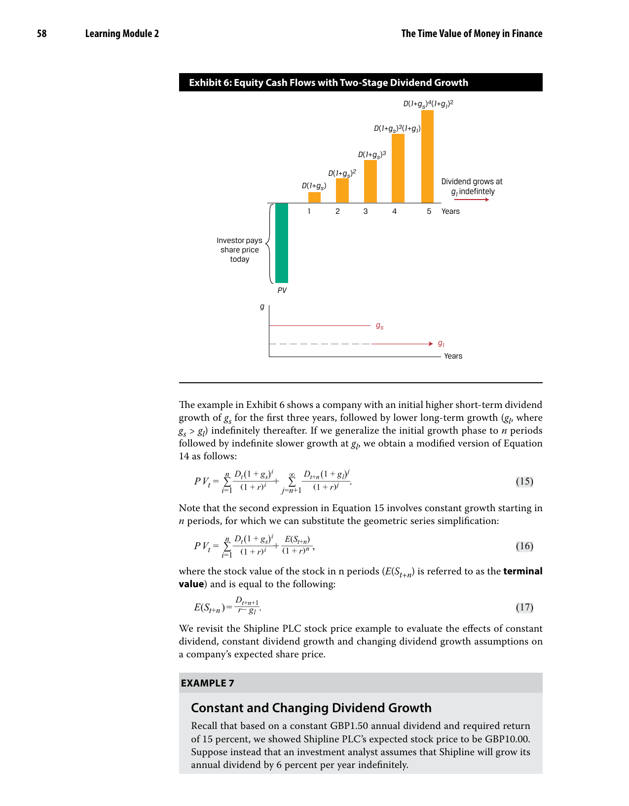

Welcome back to CFA Reading Session.

Tonight we resume exactly where episode three stopped.

We are still inside Learning Module Two.

And we are standing on the edge of Example Seven,
with Shipline PLC about to move from a constant dividend world
into a growing dividend world.

Pausa.

This is a beautiful place to continue,
because the whole second half of the module unfolds from one simple idea.

If a price today reflects future cash flows,
then changing the growth rate changes the price.

If the price today is already known,
then we can work backward and infer the return or growth that the market must be assuming.

And if two strategies create the same future cash flows,
their present values must line up,
or arbitrage appears.

Pausa lunga.

So tonight we move through one long chain.

We begin with dividend growth.

Then we infer returns from known prices in bonds and stocks.

Then we widen the frame and use cash flow additivity to think about forward interest rates,
forward exchange rates,
and finally option values.

The mood stays slow.

But the logic becomes more powerful with each step.

## Constant And Changing Dividend Growth

[Schermo: Shipline PLC / constant growth / two-stage growth]

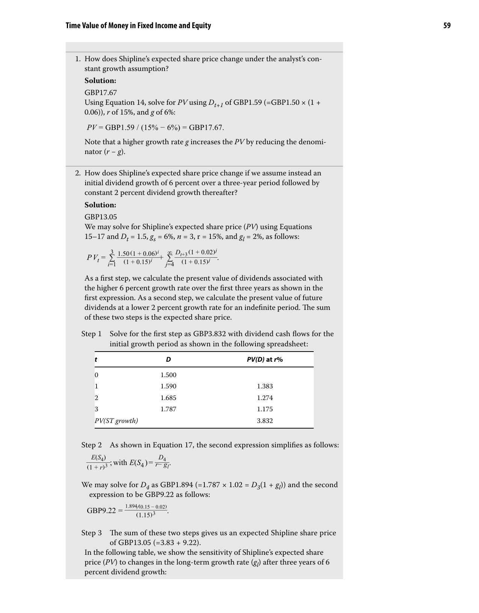

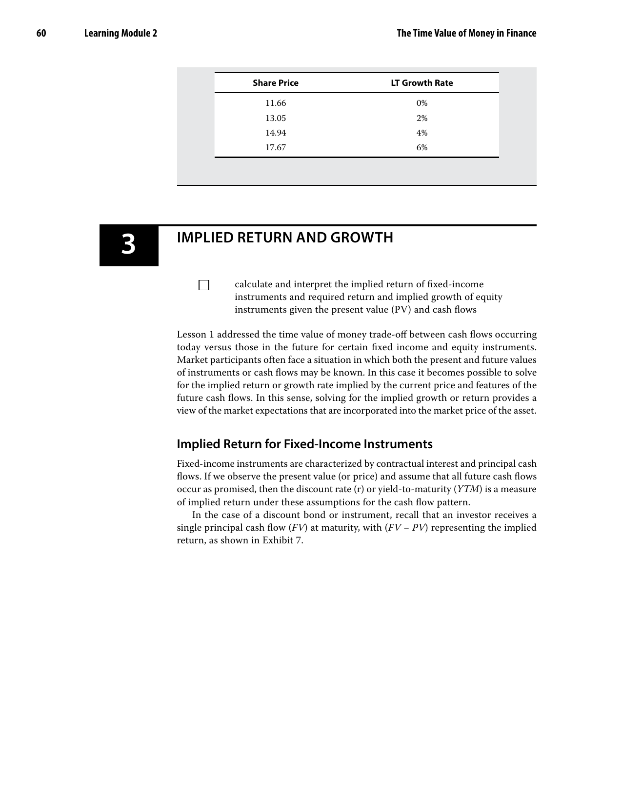

Example Seven begins by reminding us of the baseline.

Shipline pays a constant annual dividend of one pound and fifty pence.

With a required return of fifteen percent,
that gave us a share price of ten pounds in episode three.

Pausa.

Now the assumption changes.

Instead of staying flat forever,
the dividend is expected to grow at six percent per year indefinitely.

The next dividend therefore becomes:

- one point five zero times one point zero six
- which is one point five nine pounds

And once that next dividend is known,
the Gordon growth formula does the rest.

Present value equals next dividend divided by required return minus growth.

So here the price is:

- one point five nine divided by fifteen percent minus six percent

which gives seventeen pounds and sixty-seven pence.

Pausa.

That jump from ten pounds to seventeen point six seven is not a minor change.

It tells us how sensitive equity valuation can be to long-run growth assumptions.

Nothing about today's cash changed.

What changed was the expected path of future cash.

And because the denominator is now only nine percent,
instead of fifteen,
the value expands sharply.

Pausa lunga.

The example then becomes more realistic.

Suppose Shipline grows at six percent,
but only for three years.

After that,
growth settles down to two percent forever.

That is the two-stage case.

And the curriculum solves it in two calm steps.

Pausa.

Step one values the higher-growth period directly.

Using a starting dividend of one point five,
the dividends through the first three years become approximately:

- one point five nine zero in year one
- one point six eight five in year two
- one point seven eight seven in year three

Discounted at fifteen percent,
their present values are:

- one point three eight three
- one point two seven four
- one point one seven five

The sum of that first growth block is three point eight three two pounds.

Pausa.

Step two values everything that happens after year three.

Now, the dividend in year four deserves one careful note.

The curriculum prints one point eight nine four pounds,
but right beside it shows the calculation as one point seven eight seven times one point zero two,
and that product is one point eight two three.

The printed figure looks like a slip,
because it is one point eight two three that produces the nine point two two we are about to see.

So we take the year-three dividend times one point zero two,
about one point eight two pounds.

That opens the stable-growth perpetuity.

The terminal piece,
discounted back to today,
comes to nine point two two pounds.

Add the two steps together,
and Shipline's expected share price becomes thirteen pounds and five pence.

Pausa lunga.

That result is lower than seventeen point six seven,
because the six percent growth does not last forever.

But it is still higher than the ten-pound no-growth case,
because even temporary growth has value.

Pausa.

The table on the next page makes the lesson even clearer.

After three years of six percent growth,
the share price changes materially depending on the long-term growth rate:

- if long-term growth is zero percent, the price is eleven point six six
- if long-term growth is two percent, the price is thirteen point zero five
- if long-term growth is four percent, the price is fourteen point nine four
- if long-term growth is six percent, the price returns to seventeen point six seven

This is a quiet but important warning.

Long-run growth assumptions are powerful.

A small change in g,
especially when it sits close to the required return,
can move the present value a great deal.

That is why disciplined analysts treat growth inputs with caution.

## Implied Return For Fixed-Income Instruments

[Schermo: Discount bond return / coupon bond return / YTM]

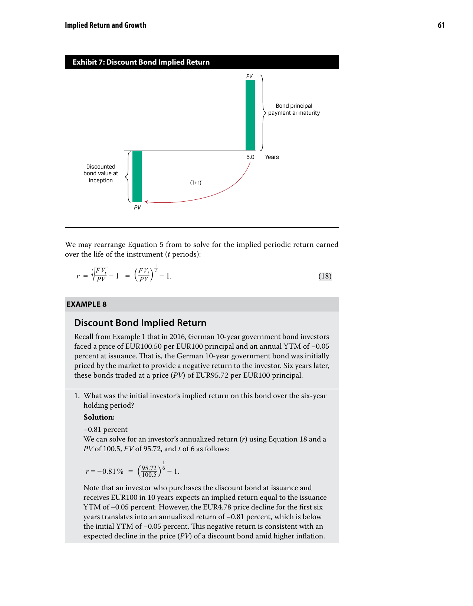

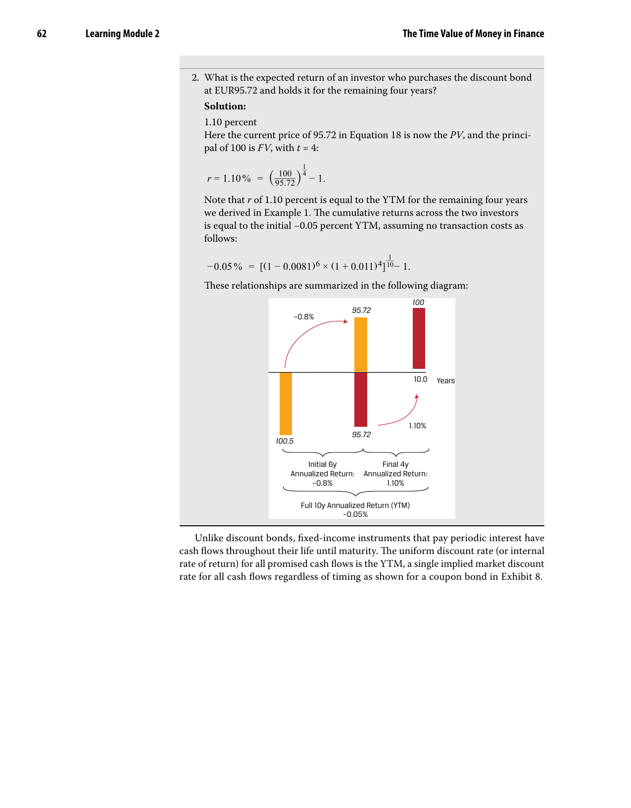

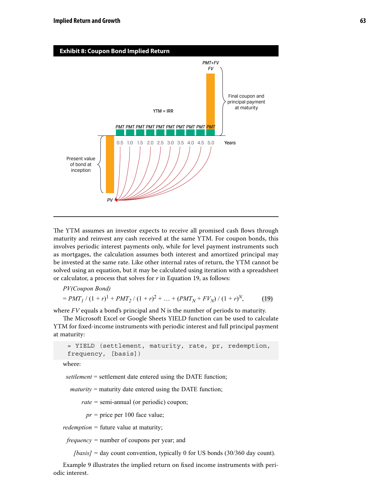

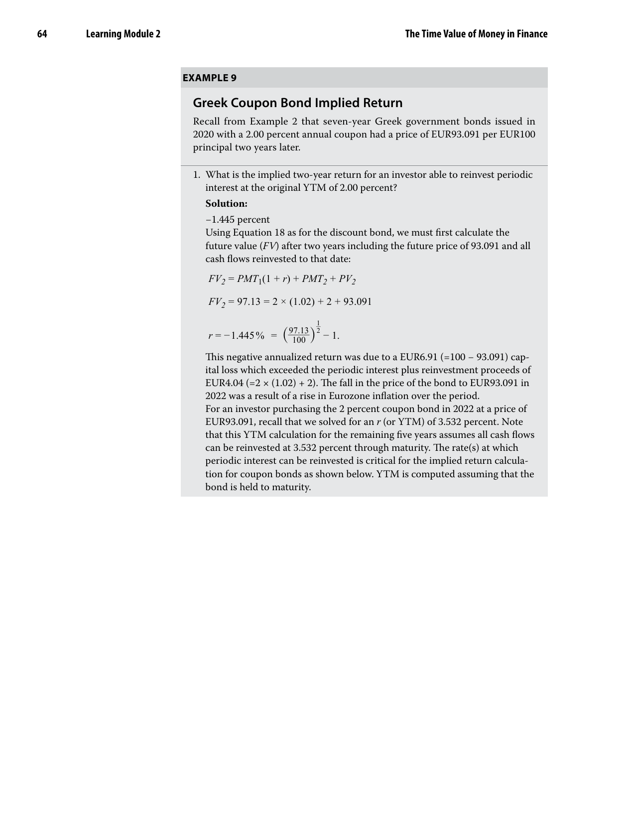

Now the reading flips the problem around.

Instead of starting with a discount rate and solving for price,
we now assume that present value and future cash flows are already known.

Then we solve for the implied return embedded in the instrument's current price.

Pausa.

For a discount bond,
the logic is especially clean.

If price today is present value,
and maturity payment is future value,
then the implied periodic return is simply the annualized rate that turns one into the other over time.

In other words:

- r equals future value divided by present value,
raised to one over t,
minus one

Pausa.

The first example returns to the German ten-year government bond from the earlier lesson.

At issuance,
it cost one hundred euro and fifty cents per one hundred euro of principal.

Six years later,
the bond trades at ninety-five euro and seventy-two cents.

If you were the original investor,
your annualized return over those six years is negative zero point eight one percent.

Pausa.

That answer is intuitive once we slow down.

You began above par,
at one hundred point five zero.

And six years later,
the bond is below par,
at ninety-five point seven two.

That is a capital loss of four euro and seventy-eight cents.

So although the bond still has four years left,
your realized holding-period experience over the first six years was worse than the tiny negative yield you accepted at issuance.

Pausa.

Then the perspective shifts.

Suppose instead you buy the same bond at ninety-five point seven two and hold it for the remaining four years until it pays one hundred.

Your expected annualized return is one point one zero percent.

And that matches the yield to maturity we had already inferred for the remaining four years.

Pausa lunga.

The curriculum then makes a satisfying connection.

If one investor experiences negative zero point eight one percent for six years,
and the next investor experiences positive one point one zero percent for four years,
the combined ten-year annualized result comes back to about negative zero point zero five percent.

That is essentially the original issuance yield to maturity.

So the full life of the bond still ties together.

Different subperiod investors can have very different experiences,
but the complete path remains internally consistent.

Pausa.

Then the reading turns from discount bonds to coupon bonds.

This is where a new layer enters:

reinvestment.

A coupon bond does not just pay once at maturity.

It pays periodic cash along the way.

So if we want an implied return over a holding period,
we need to decide what happens to those coupon cash flows after they are received.

Yield to maturity assumes they can be reinvested at the same yield.

Pausa.

That assumption is not trivial.

It is one reason coupon-bond realized returns can depart from simple intuition.

The YTM is one internal rate that discounts all promised cash flows to today's price,
but it also embeds a reinvestment assumption about intermediate coupons.

Pausa lunga.

Example Nine uses the Greek government bond from the earlier pricing example.

This is a seven-year bond with a two percent annual coupon.

Two years after issuance,
its price is ninety-three point zero nine one euro per one hundred euro of principal.

The question is:

What was the implied two-year return for the original investor,
assuming the coupons could be reinvested at the original two percent yield?

Pausa.

The future value after two years is built from three pieces:

- first coupon reinvested for one extra year
- second coupon received at the end of the holding period
- and the bond's market price at that same end date

Numerically,
that becomes:

- two times one point zero two
- plus two
- plus ninety-three point zero nine one

for a total of ninety-seven point one three.

Pausa.

Turn that ninety-seven point one three back into an annualized return from an initial one hundred,
over two years,
and the answer is negative one point four four five percent per year.

Why negative?

Because the capital loss of six point nine one euro,
from one hundred down to ninety-three point zero nine one,
was larger than the four point zero four euro gained from coupon income plus reinvestment.

Pausa lunga.

This is one of the nicest examples in the module.

It reminds us that coupon bonds are not automatically safe in realized-return terms.

The coupon helps.

Reinvestment helps.

But if price falls enough,
the total holding-period return can still be negative.

Pausa.

And it also reminds us that yield to maturity is not just a price number.

It is a framework.

It assumes the bond is held to maturity,
and it assumes intermediate cash flows can be reinvested at the same rate.

Those assumptions matter whenever we move from price to realized return.

## Implied Return And Growth For Equity Instruments

[Schermo: Dividend yield plus growth / price to earnings logic]

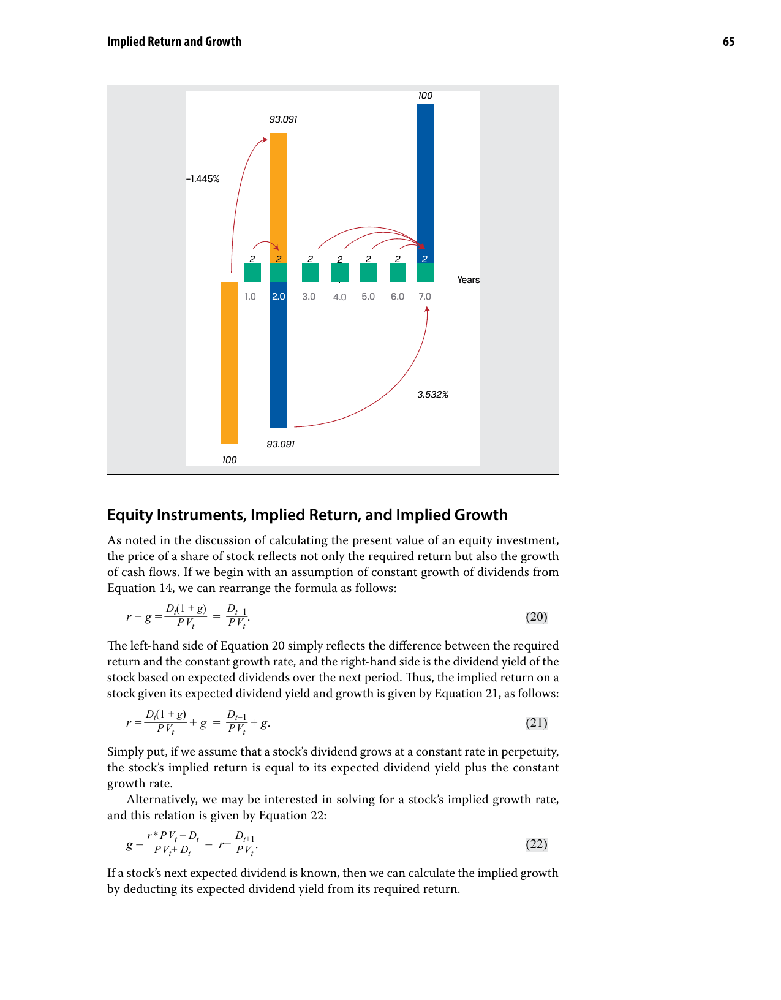

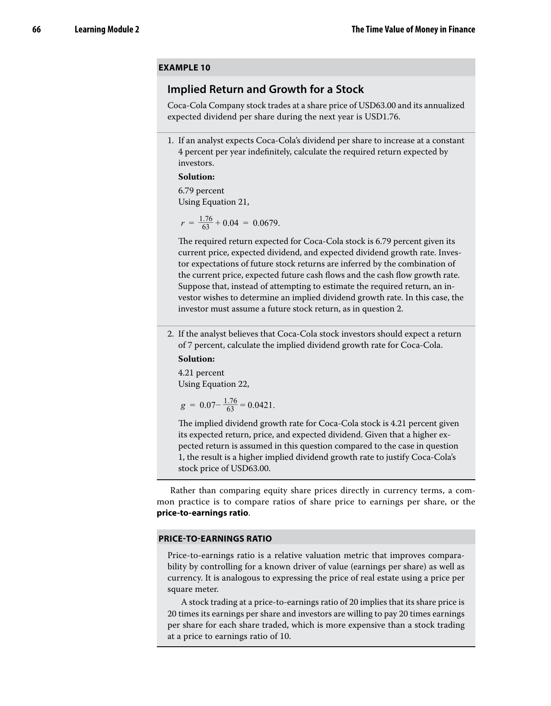

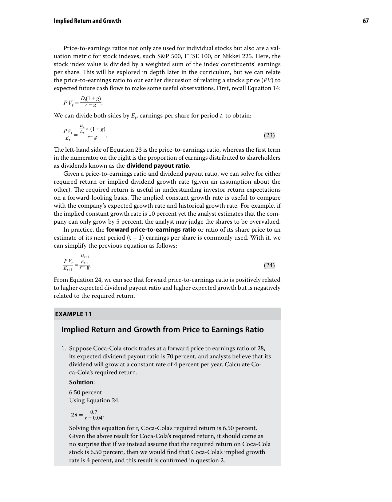

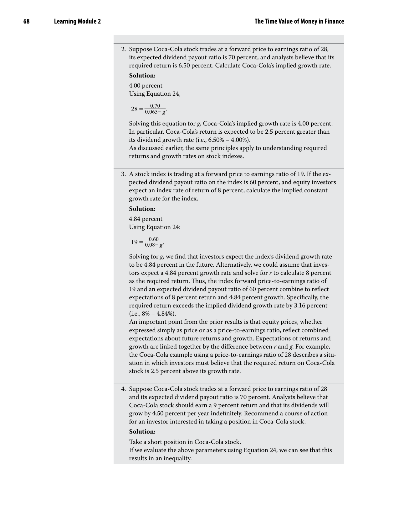

Now the module performs the same reversal in equity.

If a stock price is known,
and expected dividends are known,
then we can infer either:

- the return investors seem to require
- or the growth rate they seem to expect

Pausa.

Under constant dividend growth,
the Gordon model can be rearranged into a very compact relationship.

Required return equals expected dividend yield plus growth.

Or if required return is known,
growth equals required return minus expected dividend yield.

Pausa.

That means a stock price is never just a price.

It is a bundle of beliefs.

Beliefs about future cash.

Beliefs about future growth.

And beliefs about the return investors demand in exchange for holding the asset.

Pausa lunga.

Example Ten uses Coca-Cola.

Its share price is sixty-three dollars.

Its expected dividend during the next year is one dollar and seventy-six cents.

If an analyst expects that dividend to grow at a constant four percent per year indefinitely,
the required return implied by the current price is six point seven nine percent.

That is simply:

- one point seven six divided by sixty-three
- plus four percent

Pausa.

Then the problem is reversed.

If the analyst instead believes Coca-Cola investors should expect a seven percent return,
what growth rate is implied by the same sixty-three-dollar price and one point seven six dividend?

The answer is four point two one percent.

Because now growth is:

- seven percent minus one point seven six divided by sixty-three

Pausa.

The elegance of this is worth noticing.

The same three ingredients are present:

- price
- expected dividend
- and the relationship between return and growth

Change one assumption,
and the implied value of another variable shifts immediately.

Pausa lunga.

The reading then moves from raw share price to a more portable valuation language:

the price-to-earnings ratio.

This is helpful because it scales price by earnings per share,
making comparison easier across companies and even across stock indexes.

The forward price-to-earnings ratio links directly to three elements:

- dividend payout ratio
- required return
- and expected growth

In simplified form,
forward P over E equals payout ratio divided by r minus g.

Pausa.

So a higher payout ratio supports a higher price-to-earnings ratio.

A higher expected growth rate also supports a higher price-to-earnings ratio.

And a higher required return pushes the price-to-earnings ratio down.

That is an extremely useful mental summary.

Pausa.

Example Eleven stays with Coca-Cola.

If the stock trades at a forward price-to-earnings ratio of twenty-eight,
its expected dividend payout ratio is seventy percent,
and analysts believe dividends will grow at four percent forever,
then the required return is six point five zero percent.

Pausa.

If instead required return is fixed at six point five zero percent,
the same setup implies growth of four point zero zero percent.

No surprise there.

It is the same equation viewed from the opposite side.

Pausa.

Then the curriculum broadens out to an index.

A stock index trading at a forward price-to-earnings ratio of nineteen,
with an expected payout ratio of sixty percent,
and a required return of eight percent,
implies a constant growth rate of four point eight four percent.

That means the spread between required return and implied growth is three point one six percent.

Pausa lunga.

This spread,
r minus g,
is the quiet hinge of the whole valuation.

For Coca-Cola in the earlier example,
the market is behaving as though required return exceeds growth by two point five percent.

For the index example,
the market is behaving as though required return exceeds growth by three point one six percent.

Those spreads tell you what combination of optimism and required compensation is embedded in price.

Pausa.

The final Coca-Cola question sharpens that idea into an investment judgment.

Suppose Coca-Cola still trades at a forward price-to-earnings ratio of twenty-eight,
with a seventy percent payout ratio,
but now an analyst believes the stock should earn nine percent
and that dividends will grow only four point five percent per year.

What does that imply?

Pausa.

It implies the stock looks overvalued.

If you apply the formula with those fundamentals,
the justified forward price-to-earnings ratio is only fifteen point five six.

That is far below the observed market ratio of twenty-eight.

So the curriculum recommends a short position.

Not because twenty-eight is a scary number by itself,
but because twenty-eight is inconsistent with the analyst's own assumptions about return and growth.

Pausa lunga.

And right there,
at the bottom of the page,
the module pivots into its final big idea:

cash flow additivity.

## Cash Flow Additivity And Forward Interest Rates

[Schermo: Present values add / no-arbitrage / forward rates]

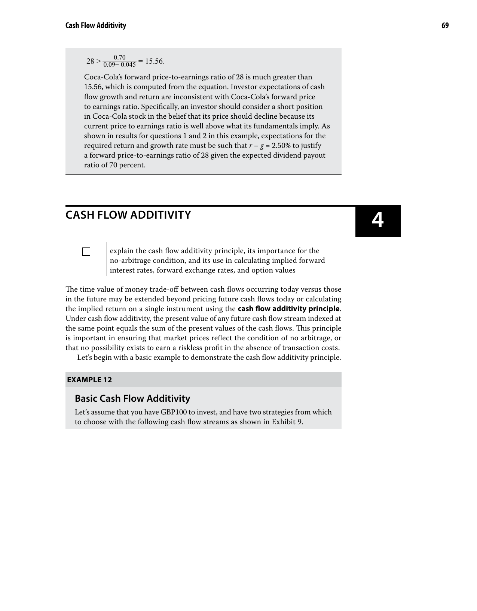

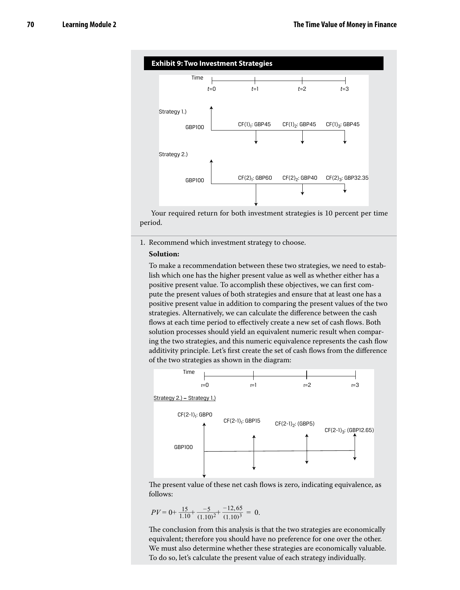

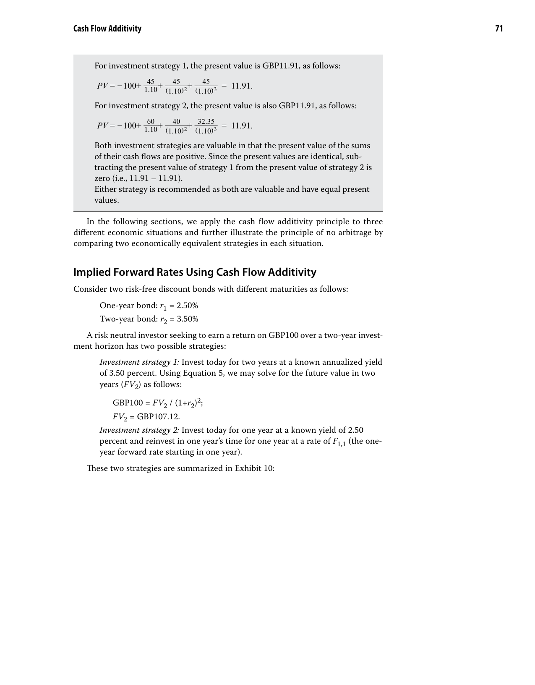

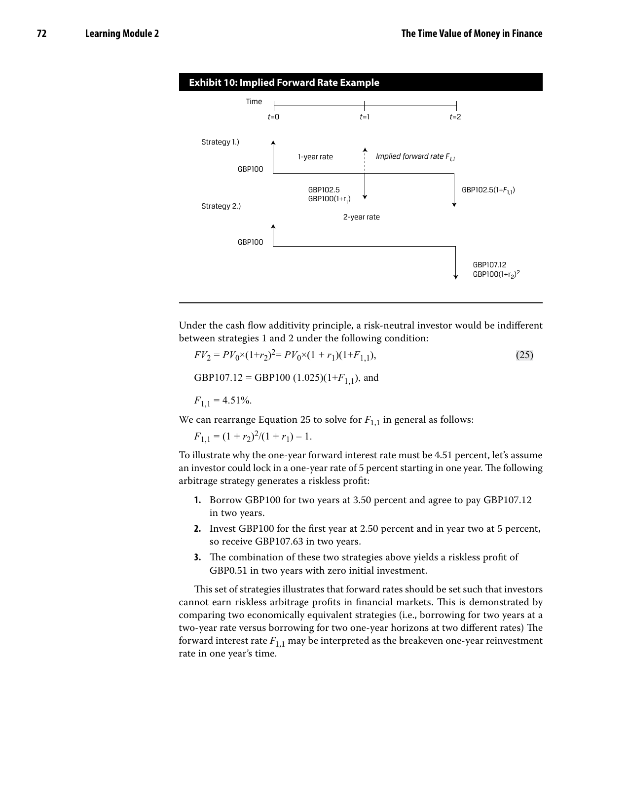

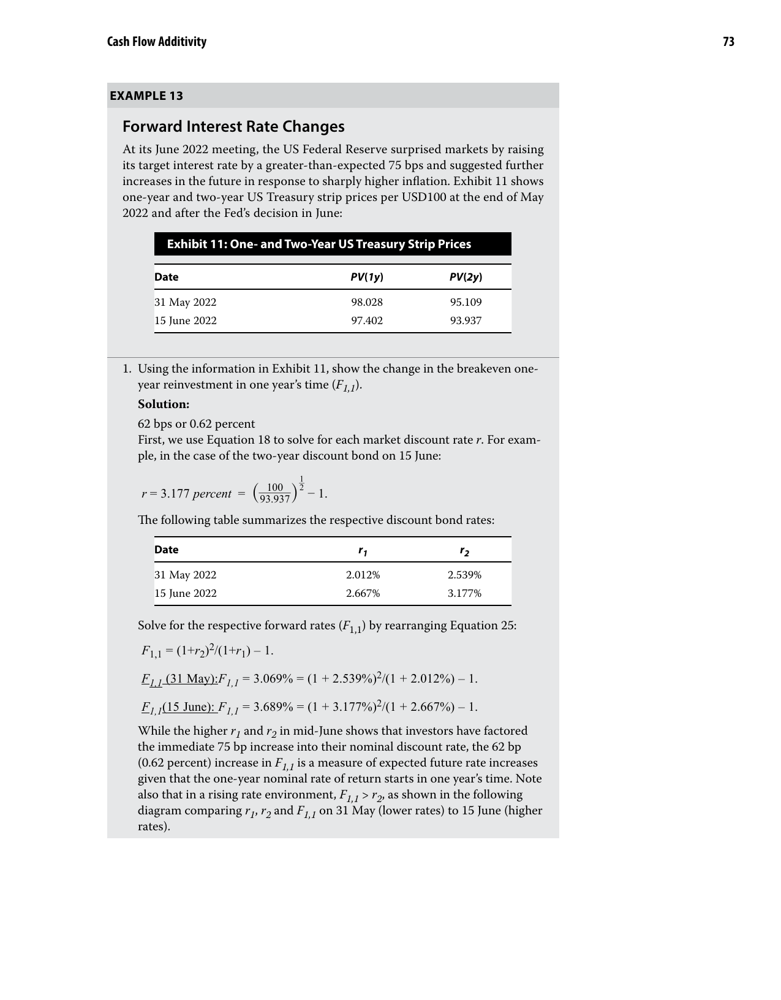

Cash flow additivity sounds abstract at first.

But the intuition is very concrete.

If cash flows occur at the same dates,
the present value of the whole stream must equal the sum of the present values of the pieces.

And if two strategies create the same cash flows,
they must have the same price.

Otherwise,
someone could buy the cheaper one,
sell the richer one,
and lock in a riskless profit.

Pausa.

That is the no-arbitrage condition in a very calm form.

Equivalent cash flows.

Equivalent value.

Pausa lunga.

Example Twelve starts with two investment strategies built from one hundred pounds today.

At a required return of ten percent per period,
strategy one pays:

- forty-five pounds at time one
- forty-five pounds at time two
- forty-five pounds at time three

Strategy two pays:

- sixty pounds at time one
- forty pounds at time two
- and thirty-two point three five pounds at time three

Pausa.

One way to compare them is to subtract strategy one from strategy two period by period.

That creates net cash flows of:

- zero at time zero
- plus fifteen at time one
- minus five at time two
- minus twelve point six five at time three

Discount those at ten percent,
and the present value is exactly zero.

So the strategies are economically equivalent.

Pausa.

You can also price them separately.

Each one has a present value of eleven point nine one pounds.

So not only are they equivalent,
they are both valuable.

If you can choose either,
you should be indifferent.

Pausa lunga.

That simple example opens the door to implied forward rates.

Suppose a one-year risk-free bond yields two point five zero percent
and a two-year risk-free bond yields three point five zero percent.

A risk-neutral investor with one hundred pounds over a two-year horizon has two ways to reach the end:

- invest for two years immediately at the known two-year rate
- or invest for one year now and then reinvest for a second year at a forward rate starting one year from today

Pausa.

The two-year direct strategy turns one hundred pounds into one hundred seven pounds and twelve pence.

So the one-year reinvestment rate in one year's time must be the rate that makes the split strategy land in the same place.

That implied forward rate is four point five one percent.

Pausa.

And the reason it must be four point five one is arbitrage.

If investors could lock in five percent instead,
they could borrow for two years at three point five percent,
invest for one year at two point five percent and the second year at five percent,
and end with a riskless profit of fifty-one pence on zero initial investment.

That is exactly what the module wants you to see.

Forward rates are not arbitrary quotes.

They are breakeven rates pinned down by no-arbitrage relationships.

Pausa lunga.

Example Thirteen brings the idea into real market data.

At the end of May 2022,
one-year and two-year US Treasury strip prices per one hundred dollars were:

- ninety-eight point zero two eight
- and ninety-five point one zero nine

After the Federal Reserve surprise in mid-June,
they became:

- ninety-seven point four zero two
- and ninety-three point nine three seven

Pausa.

Those price moves imply the following discount rates:

- on 31 May, one-year two point zero one two percent and two-year two point five three nine percent
- on 15 June, one-year two point six six seven percent and two-year three point one seven seven percent

Using those,
the implied one-year forward rate starting in one year rises from three point zero six nine percent
to three point six eight nine percent.

That is an increase of sixty-two basis points.

Pausa.

So even though the immediate policy move was seventy-five basis points,
the forward rate isolates what the market changed in its expectation for the year after the next twelve months.

That is why the example is useful.

Forward rates are expectation-rich objects.

They help separate what is happening now from what the market believes will happen later.

## Forward Exchange Rates Using No-Arbitrage

[Schermo: Currency forwards / interest differentials / implied depreciation]

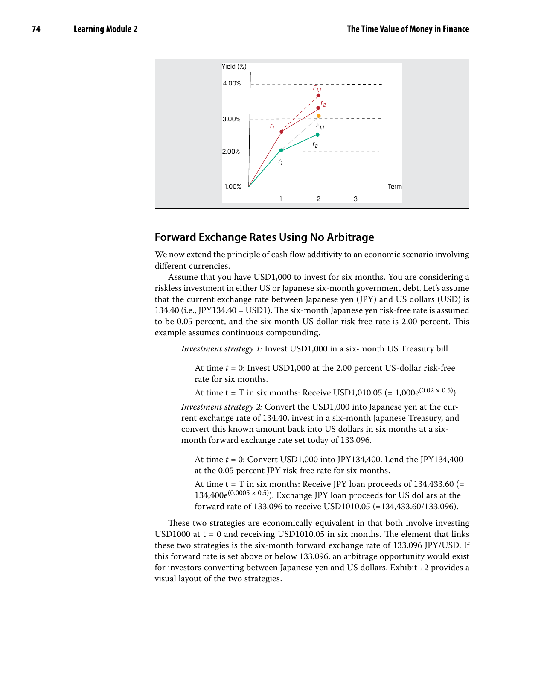

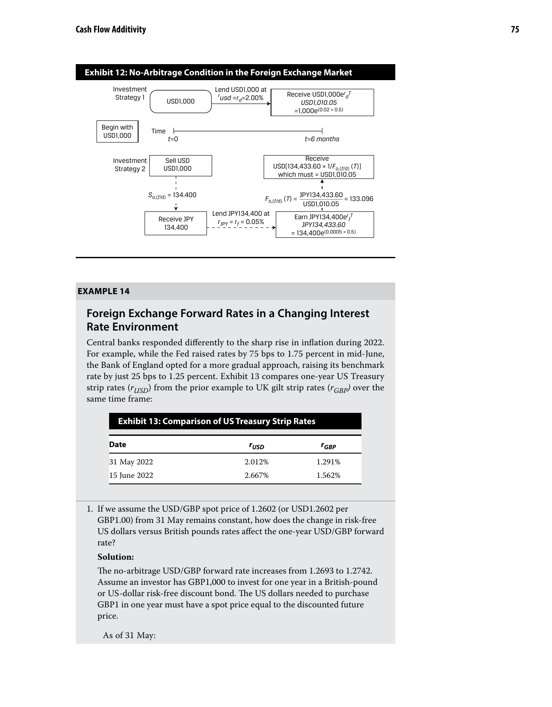

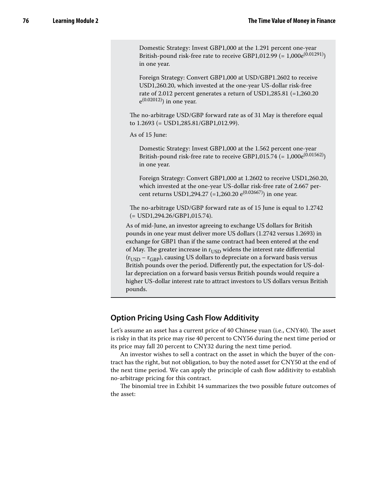

The module then extends the same no-arbitrage logic across currencies.

And this is one of the places where finance starts feeling especially elegant.

Because now a forward exchange rate is not just a market opinion.

It is the exchange rate that equalizes two risk-free strategies in different currencies.

Pausa.

The first setup uses six months,
US dollars,
and Japanese yen.

You have one thousand US dollars to invest.

The spot exchange rate is one hundred thirty-four point four zero yen per dollar.

The six-month Japanese risk-free rate is zero point zero five percent.

The six-month US-dollar risk-free rate is two point zero zero percent.

This example uses continuous compounding.

Pausa.

If you stay in dollars,
the six-month US investment grows to one thousand ten dollars and five cents.

If instead you convert into yen,
you start with one hundred thirty-four thousand four hundred yen,
lend it at the Japanese risk-free rate,
and end with one hundred thirty-four thousand four hundred thirty-three point six zero yen.

To make that second strategy exactly equivalent to the dollar strategy,
the six-month forward exchange rate must be one hundred thirty-three point zero nine six yen per dollar.

At that rate,
the yen proceeds convert back to the same one thousand ten dollars and five cents.

Pausa lunga.

So the no-arbitrage forward rate is not guessed.

It is implied by the combination of:

- the spot rate
- the domestic risk-free rate
- the foreign risk-free rate
- and the investment horizon

If the forward were set materially above or below that break-even level,
one currency strategy would dominate the other,
and arbitrage would appear.

Pausa.

Example Fourteen moves to US dollars and British pounds in a changing rate environment.

The USD to GBP spot price is one point two six zero two dollars per pound.

On 31 May 2022,
the one-year US Treasury strip rate is two point zero one two percent
and the one-year UK gilt strip rate is one point two nine one percent.

On 15 June,
those become two point six six seven percent
and one point five six two percent.

Pausa.

Under no-arbitrage,
the one-year USD to GBP forward rate rises from one point two six nine three
to one point two seven four two.

In plain language,
an investor promising to deliver dollars for pounds one year ahead must deliver more dollars per pound after the US-UK rate differential widens.

Pausa.

That is the economic interpretation the curriculum emphasizes.

When the US-dollar risk-free rate rises by more than the British-pound rate,
the forward market reflects an expected depreciation of the dollar relative to the pound.

The higher dollar interest rate is part of the compensation investors require to hold dollars instead of pounds.

Pausa lunga.

So once again,
forward prices are not floating in the air.

They are linked tightly to spot prices and discount rates.

## Option Pricing Using Cash Flow Additivity

[Schermo: Replicating portfolios / call option / put option]

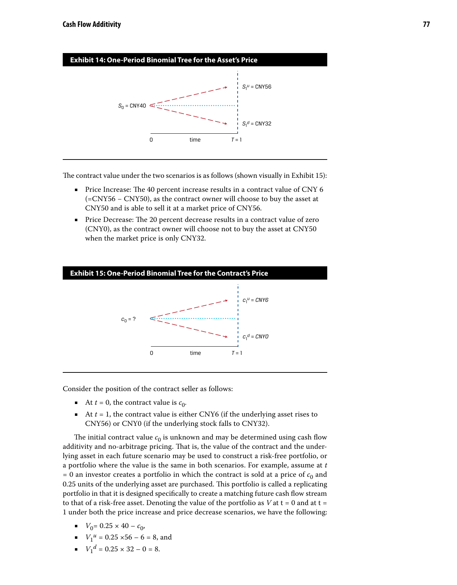

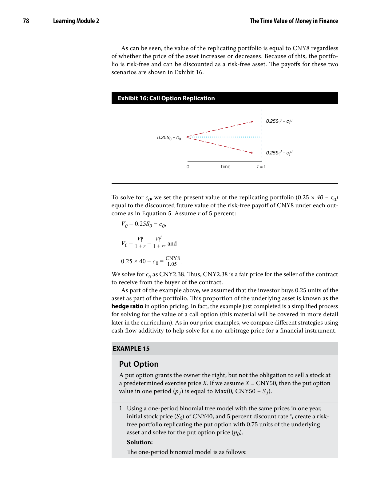

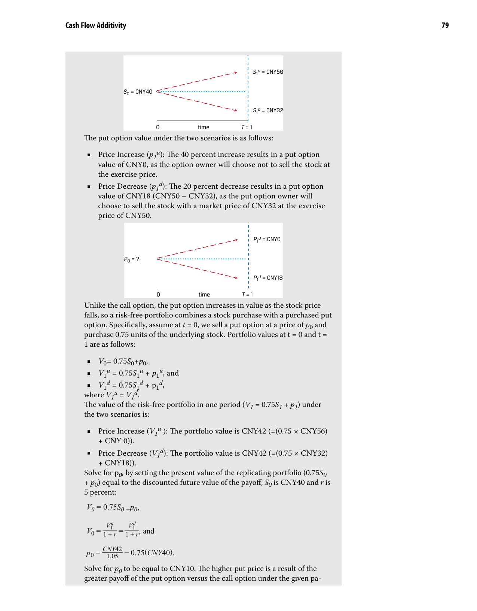

The final application is option pricing.

And the module keeps it deliberately simple:

a one-period binomial tree,
two possible future stock prices,
and a risk-free rate.

Pausa.

The underlying asset starts at forty Chinese yuan.

In one period,
it either rises forty percent to fifty-six
or falls twenty percent to thirty-two.

The exercise price is fifty.

Pausa.

Start with the call option.

If the stock rises to fifty-six,
the call is worth six,
because the owner can buy at fifty and immediately own something worth fifty-six.

If the stock falls to thirty-two,
the call is worth zero,
because nobody will pay fifty for something worth only thirty-two.

Pausa.

Now comes the replication step.

If an investor sells the call
and buys zero point two five units of the stock,
the portfolio payoff is:

- in the up state, zero point two five times fifty-six minus six, which equals eight
- in the down state, zero point two five times thirty-two minus zero, which also equals eight

That means the portfolio is risk-free.

Pausa lunga.

A risk-free payoff of eight one period from now,
discounted at five percent,
has a present value of seven point six two approximately.

So:

- zero point two five times forty minus call price today

must equal that same present value.

Solve the equation,
and the fair call price is two point three eight yuan.

Pausa.

The zero point two five stock weight is the hedge ratio.

It is the amount of the underlying needed to neutralize the option's state-by-state risk in this simple tree.

That is the real conceptual prize of the example.

Options can be valued by replication.

Pausa lunga.

Then the module turns to the put option with the same stock and the same strike.

If the stock rises to fifty-six,
the put is worthless.

If the stock falls to thirty-two,
the put is worth eighteen,
because the holder can sell at fifty something worth only thirty-two.

Pausa.

This time the replicating portfolio uses zero point seven five units of stock together with the put.

Its payoff is:

- in the up state, zero point seven five times fifty-six plus zero, which equals forty-two
- in the down state, zero point seven five times thirty-two plus eighteen, which also equals forty-two

Again the payoff is identical in both states.

So again the portfolio is risk-free.

Pausa.

Discount forty-two back one period at five percent,
and the present value is exactly forty.

Since zero point seven five times the current stock price is thirty,
the put price today must be ten.

Pausa lunga.

So under these particular parameters:

- call value is two point three eight
- put value is ten

The put is much more valuable,
because the downside state creates a large payoff for the put
while the call's upside payoff is comparatively modest.

Pausa.

The curriculum notes that option pricing will be treated in much more depth later.

But even here,
the essential structure is already visible.

Replication.

State-by-state payoffs.

Discounting a risk-free portfolio.

And no-arbitrage as the anchor.

## Closing

[Schermo: Learning Module 2 completed / practice problems next]

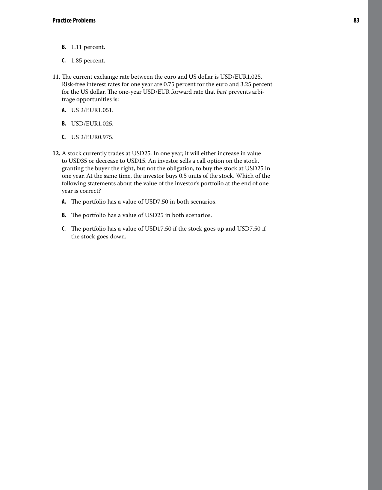

Tonight we completed the full narrative arc of Learning Module Two.

We began with Shipline,
where a dividend growth assumption changed the share price dramatically.

We then reversed the logic and solved for implied return in bonds
and implied return or growth in stocks.

Pausa.

After that,
the module widened from single securities to relationships between securities.

Cash flow additivity told us that equivalent future cash flows must carry equivalent present values.

That gave us forward interest rates,
forward exchange rates,
and the first outline of option replication.

Pausa lunga.

The three pages now on screen mark the start of the practice problems.

And they are a very clean handoff point.

The questions revisit almost everything we touched tonight:

- coupon bond pricing and yield
- mortgage cash flows
- constant and two-stage dividend growth
- implied equity return and index valuation
- forward interest rates
- foreign exchange forwards
- and a small option replication setup

Pausa.

So if episode three was the bridge into time value of money,
episode four is the completion of the module's main argument.

Price and cash flow are two sides of the same object.

Returns and growth can be inferred from price.

And no-arbitrage keeps economically equivalent strategies aligned.

Pausa lunga.

That is where we stop.

Not in the middle of an example.

But at the exact moment the curriculum turns from teaching the machinery
to testing whether the machinery is now internal.

Rest well.
Study well.
And I will see you in the next reading session.
