# CFA READING SESSION 05

Versione teleprompter
Linea guida: "Calm, accurate, sleep-friendly"

Nota di lavoro:
- source base: CFA Level I 2024 Volume 1
- coverage: practice problems and solutions of Learning Module 2 plus the opening of Learning Module 3
- approximate PDF coverage for this episode: pages 93 to 112
- adapted for spoken delivery and pacing, without inventing facts beyond the source
- figures in flusso: original PDF page captures

## Opening

[Schermo: CFA Level I / Volume 1 / Session 05]

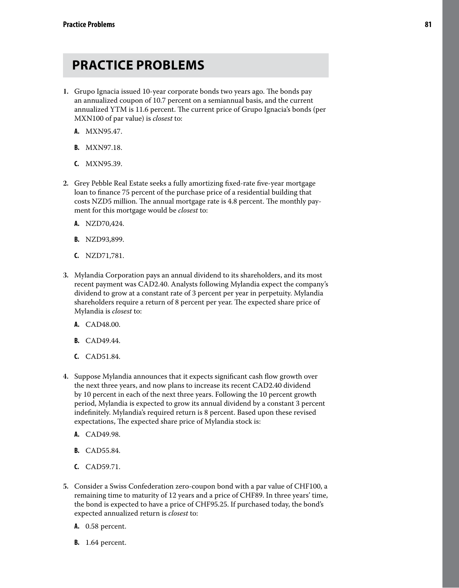

Welcome back to CFA Reading Session.

Tonight we do two complementary things.

First,
we pressure-test Learning Module Two by walking through its practice set.

Then,
once the formulas have been tested,
we turn the page and open Learning Module Three:

Statistical Measures of Asset Returns.

Pausa.

That makes this episode feel a little like a hinge.

The first half asks whether the time-value-of-money machinery really works under exam-style questions.

The second half shifts from valuation to description,
from pricing cash flows to summarizing distributions.

Pausa lunga.

So tonight we move from:

- bonds
- mortgages
- dividend growth
- implied return
- forward rates
- foreign exchange forwards
- and option replication

into a new language:

- mean
- median
- mode
- quantiles
- box plots
- and the first statistical description of returns

The pace stays quiet.

But the toolkit changes.

## Practice Problems: Bonds, Mortgages, And Dividend Models

[Schermo: Learning Module 2 / practice set / valuation drills]

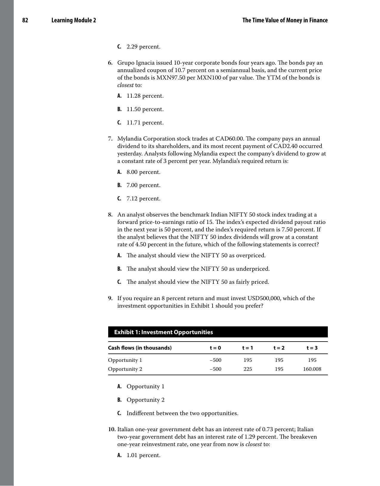

The first five practice problems revisit the core mechanics of Learning Module Two.

And they do it in a nice order:

price a bond,
price a mortgage,
price a stock with constant growth,
price a stock with two-stage growth,
and then infer a holding-period return on a zero-coupon bond.

Pausa.

Question one gives Grupo Ignacia bonds.

Ten-year corporate bonds were issued two years ago.

They pay an annualized coupon of ten point seven percent on a semiannual basis.

The current annualized yield to maturity is eleven point six percent.

And the question asks for the bond's current price per one hundred Mexican pesos of par.

The correct answer is ninety-five point three nine.

That problem is mostly a discipline test.

Use the semiannual coupon of five point three five,
the semiannual discount rate of five point eight percent,
and the sixteen remaining half-year periods.

Pausa.

Question two turns to a fully amortizing fixed-rate five-year mortgage for Grey Pebble Real Estate.

Seventy-five percent of a five million New Zealand dollar building is financed.

The annual mortgage rate is four point eight percent.

The monthly payment is seventy thousand four hundred twenty-four New Zealand dollars.

Again,
the hidden exam trap is period conversion:

- principal is three point seven five million
- monthly rate is zero point four percent
- number of periods is sixty

Pausa.

Question three is a constant-growth equity problem.

Mylandia's most recent dividend was two dollars and forty cents Canadian.

Growth is expected at three percent forever.

Required return is eight percent.

So the next dividend is two point four seven two,
and the expected share price is forty-nine dollars and forty-four cents.

Pausa.

Question four extends that same stock into a two-stage growth case.

Mylandia now grows dividends ten percent per year for three years,
then three percent forever after.

Required return remains eight percent.

The expected share price is fifty-nine dollars and seventy-one cents.

That answer comes from exactly the same logic we used in the Shipline example:

- discount the first three dividends directly
- then add the discounted terminal value at the moment stable growth begins

Pausa lunga.

Question five steps back into fixed income with a Swiss Confederation zero-coupon bond.

Par is one hundred Swiss francs.

Twelve years remain to maturity.

Current price is eighty-nine.

In three years,
the bond is expected to trade at ninety-five point two five.

The expected annualized return from buying today and holding for those three years is two point two nine percent.

This is a good reminder that the holding-period return over a subperiod is not the same thing as the full-life yield to maturity.

## Practice Problems: Yields, Forward Rates, FX, And Option Replication

[Schermo: Learning Module 2 / implied return / forwards / options]

The rest of the practice set broadens the terrain.

It moves from pure pricing into implied return,
market consistency,
and no-arbitrage relationships.

Pausa.

Question six returns to Grupo Ignacia's bonds,
but now the price is given as ninety-seven point five zero per one hundred of par,
and the task is to solve for the yield to maturity.

The correct annualized answer is eleven point two eight percent.

That comes from solving the bond rate in semiannual terms and then annualizing it.

Pausa.

Question seven returns to Mylandia.

The stock trades at sixty Canadian dollars.

The most recent dividend of two point four zero was paid yesterday.

Expected dividend growth is three percent.

The required return is seven point one two percent.

That is a compact Gordon growth reversal:

- next dividend is two point four seven two
- dividend yield is two point four seven two divided by sixty
- then add three percent growth

Pausa.

Question eight shifts to the Indian NIFTY 50 index.

The forward price-to-earnings ratio is fifteen.

Expected payout ratio is fifty percent.

Required return is seven point five percent.

If an analyst believes dividends will grow at four point five percent,
the index should be viewed as underpriced.

Why?

Because those fundamentals imply a justified forward price-to-earnings ratio higher than fifteen.

Pausa lunga.

Question nine asks whether two investment opportunities should be preferred,
given an eight percent required return and a five hundred thousand dollar investment.

The quiet answer is:

- be indifferent

because the two cash-flow streams are economically equivalent once discounted.

This is a direct application of cash flow additivity.

Pausa.

Question ten asks for the breakeven one-year reinvestment rate,
one year from now,
when Italian one-year debt yields zero point seven three percent
and Italian two-year debt yields one point two nine percent.

The answer is one point eight five percent.

That is the forward rate implied by the one-year and two-year spot rates.

Pausa.

Question eleven asks for the no-arbitrage one-year dollar-per-euro forward rate.

Spot is one point zero two five dollars per euro.

Euro risk-free rate is zero point seven five percent.

US dollar risk-free rate is three point two five percent.

The correct forward rate is one point zero five one dollars per euro.

Pausa lunga.

And question twelve closes the set with a tiny option replication problem.

A stock is worth twenty-five dollars today.

In one year it is either thirty-five or fifteen.

An investor sells a call with strike twenty-five
and at the same time buys zero point five units of the stock.

The value of that portfolio in one year is seven dollars and fifty cents in both scenarios.

That is exactly the type of equalized payoff that no-arbitrage pricing depends on.

## Practice Problems: Solutions And What They Confirm

[Schermo: Solutions / what the practice set is really testing]

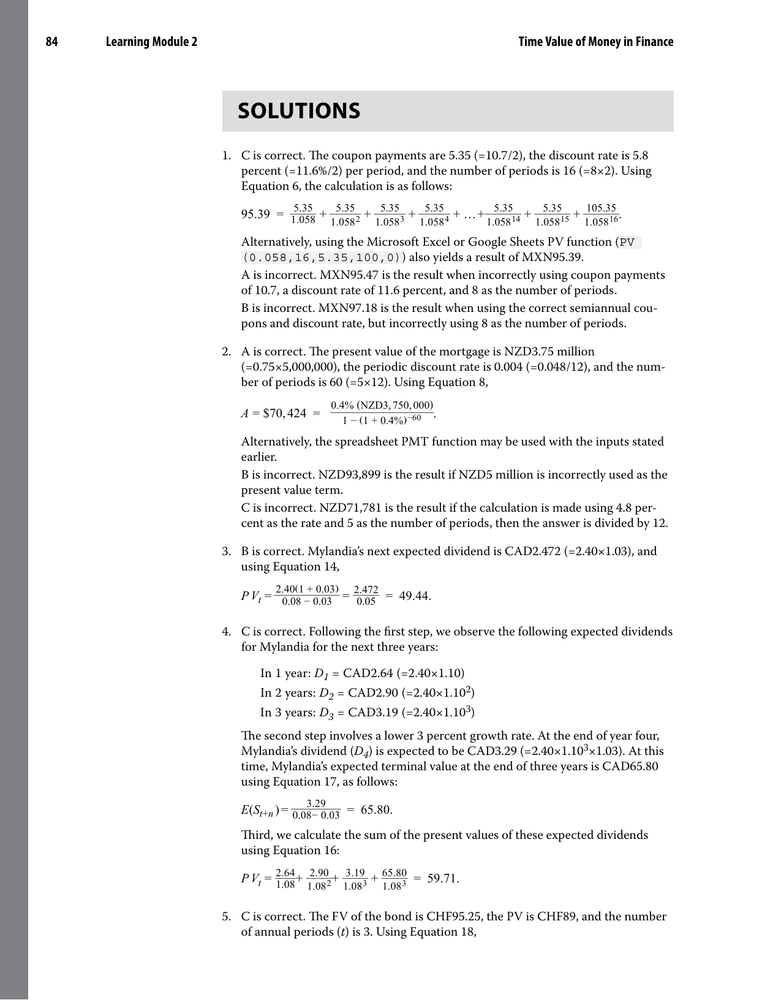

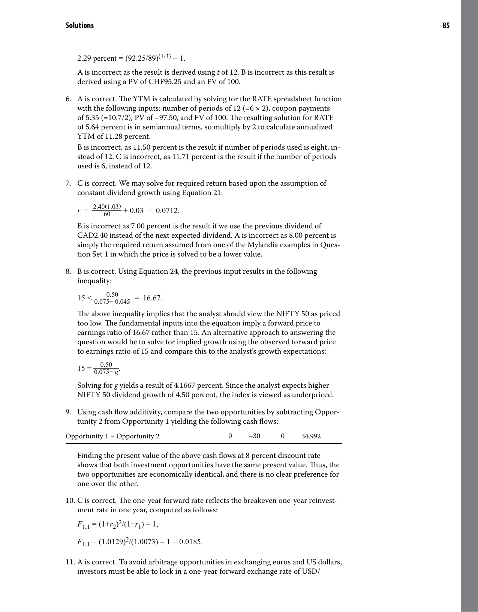

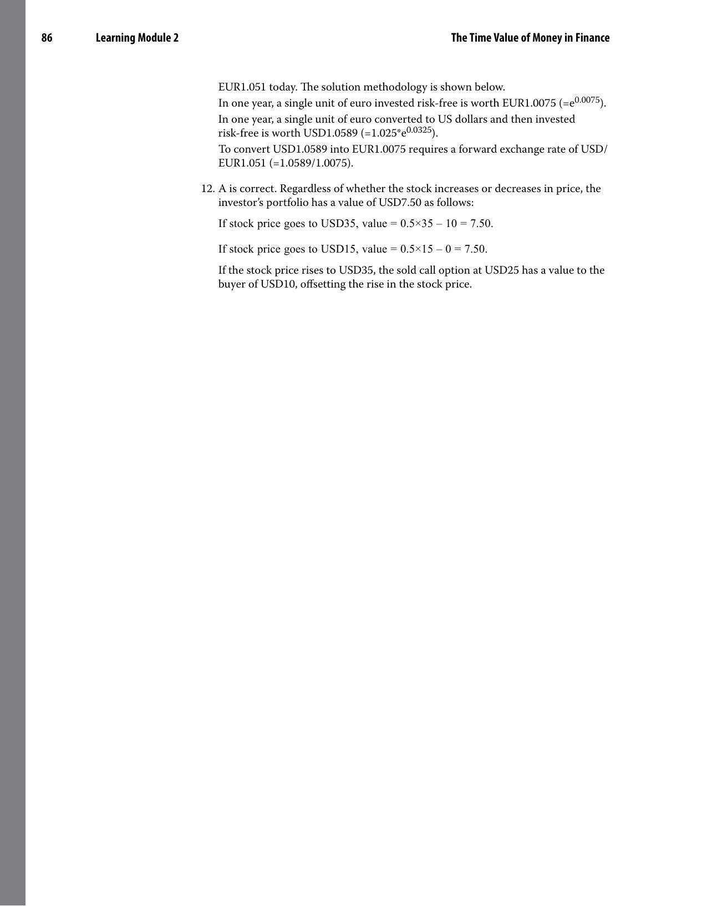

The solution pages are useful not only because they give the answer,
but because they reveal exactly what the curriculum expects you to treat as the decisive input.

Pausa.

For the Grupo Ignacia bond price question,
the curriculum explicitly says:

- coupon is five point three five
- discount rate per period is five point eight percent
- remaining periods are sixteen

and that is what produces ninety-five point three nine.

The wrong answers are what you get if you fail to convert coupons and periods correctly.

Pausa.

For the Grey Pebble mortgage,
the present value is three point seven five million,
the monthly rate is zero point zero zero four,
and the number of periods is sixty.

That yields seventy thousand four hundred twenty-four.

Again,
the distractors are really period-conversion mistakes.

Pausa.

For Mylandia with constant growth,
the next dividend is two point four seven two
and the price is forty-nine point four four.

For the two-stage case,
the first three dividends are two point six four,
two point nine zero,
and three point one nine.

Then year-four dividend is three point two nine,
the terminal value at the end of year three is sixty-five point eight zero,
and the present value sums to fifty-nine point seven one.

Pausa lunga.

The Swiss bond question confirms the holding-period return result of two point two nine percent using future value ninety-five point two five,
present value eighty-nine,
and three years.

The second Grupo Ignacia problem confirms that the bond yield is eleven point two eight percent,
not eleven point five zero and not eleven point seven one,
because the bond has twelve remaining semiannual periods,
not eight and not six.

Pausa.

The Mylandia required-return problem confirms the role of the next expected dividend.

Using yesterday's dividend of two point four zero would be wrong.

The correct return is based on two point four zero times one point zero three over sixty,
plus growth,
which gives seven point one two percent.

Pausa.

The NIFTY problem is especially nice because the solution shows two valid paths.

One path calculates the justified forward price-to-earnings ratio directly
and gets sixteen point six seven,
which is above the observed fifteen.

The other path solves for implied growth at the observed ratio
and gets four point one six six seven percent,
which is below the analyst's expected four point five percent growth.

Both paths lead to the same conclusion:

- the index appears underpriced

Pausa lunga.

The solutions then make the additivity and no-arbitrage logic explicit.

The two investment opportunities in question nine become equivalent once you subtract one from the other and discount the difference at eight percent.

Question ten confirms the Italian forward rate of one point eight five percent.

Question eleven confirms the forward exchange rate of one point zero five one dollars per euro.

And question twelve confirms the replicated stock-plus-short-call payoff of seven point five zero in both states:

- zero point five times thirty-five minus ten
- and zero point five times fifteen minus zero

Pausa.

This is why the practice set matters.

It is not just asking you to remember formulas.

It is checking whether you know which version of the formula applies,
which time unit matters,
which dividend belongs in the numerator,
and which quantities must match if no-arbitrage is to hold.

That is a much better test of understanding than a passive reading alone.

## Learning Module 3: The New Map

[Schermo: Statistical Measures of Asset Returns / why description matters]

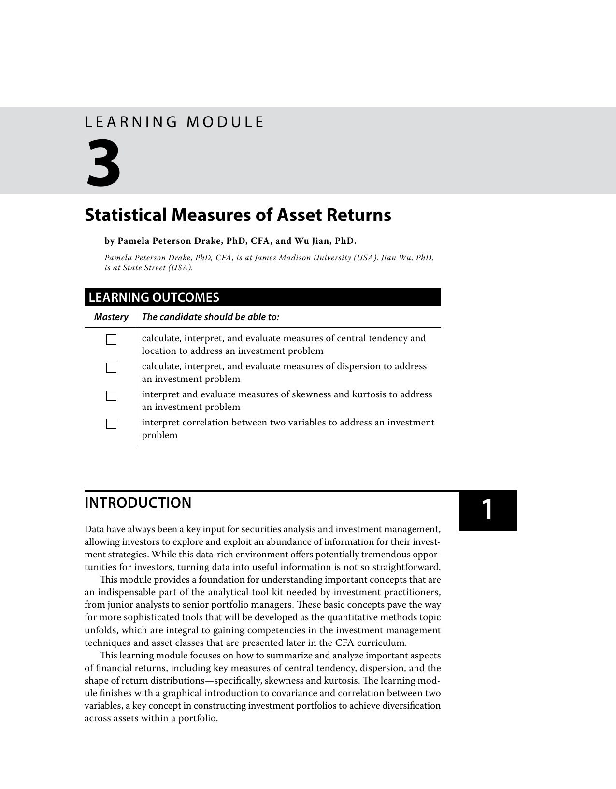

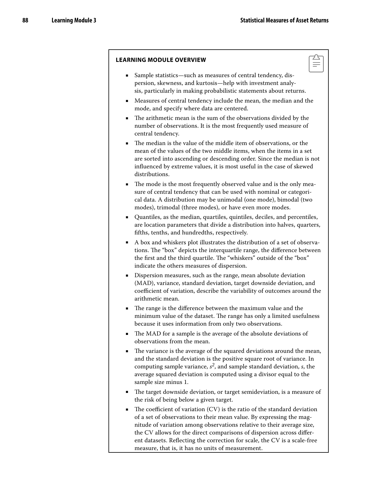

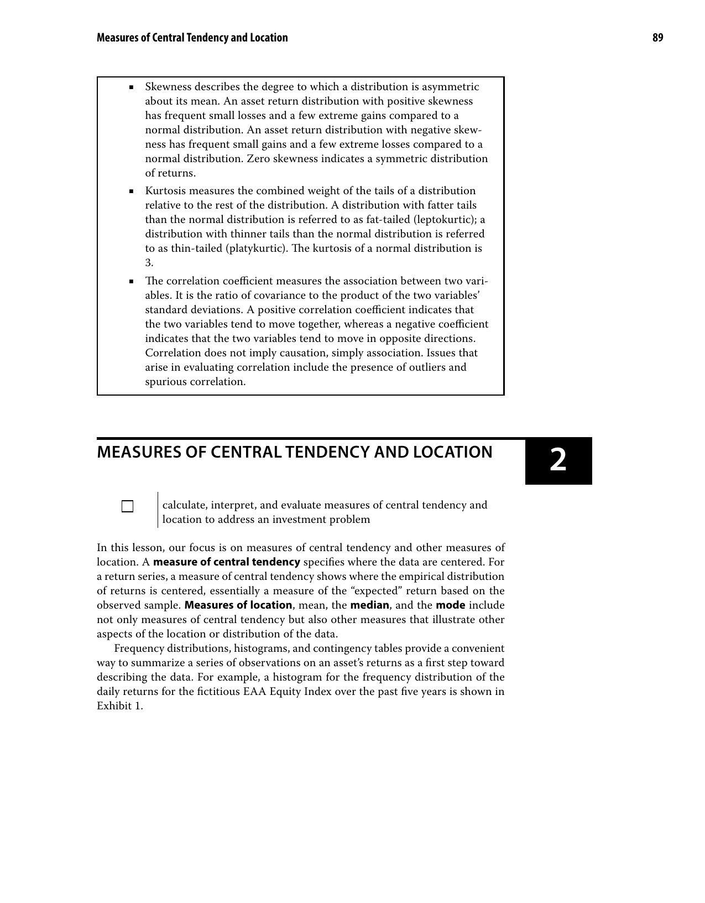

Now the curriculum turns again.

Learning Module Three is called:

- Statistical Measures of Asset Returns

And its mission is different from Learning Module Two.

Pausa.

Before,
we asked how to price cash flows,
infer returns,
and protect no-arbitrage consistency.

Now we ask how to summarize and interpret data.

Especially return data.

Pausa lunga.

The learning outcomes lay out four broad jobs.

We should be able to:

- calculate and evaluate measures of central tendency and location
- calculate and evaluate measures of dispersion
- interpret skewness and kurtosis
- and interpret correlation between two variables

Pausa.

That means this module is really about describing the shape of information.

Where the data are centered.

How spread out they are.

Whether they lean to one side.

Whether their tails are fat.

And whether two variables move together.

Pausa.

The overview pages give a compact map.

Measures of central tendency include:

- mean
- median
- mode

Location measures include:

- quartiles
- quintiles
- deciles
- percentiles

Dispersion measures include:

- range
- mean absolute deviation
- variance
- standard deviation
- target downside deviation
- coefficient of variation

Pausa lunga.

And just from the overview,
the curriculum is already giving some interpretive hints.

Median is especially useful in skewed distributions because it is less affected by extreme values.

The standard deviation is the square root of variance and uses the same units as the data.

The coefficient of variation is scale-free,
so it helps compare datasets with different means or different units.

Pausa.

By the end of the second overview page,
the module has also previewed skewness,
kurtosis,
and correlation.

But for tonight,
we stop before the dispersion section really begins.

So our focus is the opening statistical layer:

central tendency,
outliers,
quantiles,
and box plots.

## Mean, Median, Mode, And Outliers

[Schermo: Central tendency / representative outcomes / robust summaries]

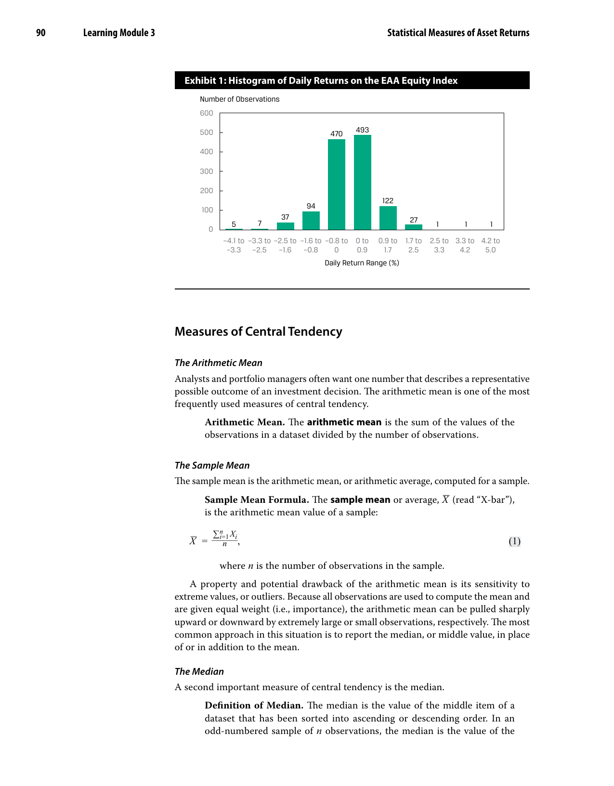

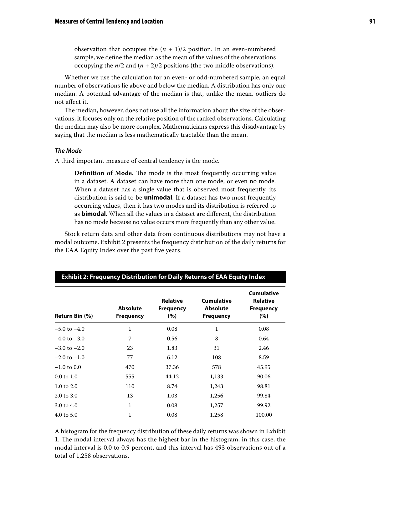

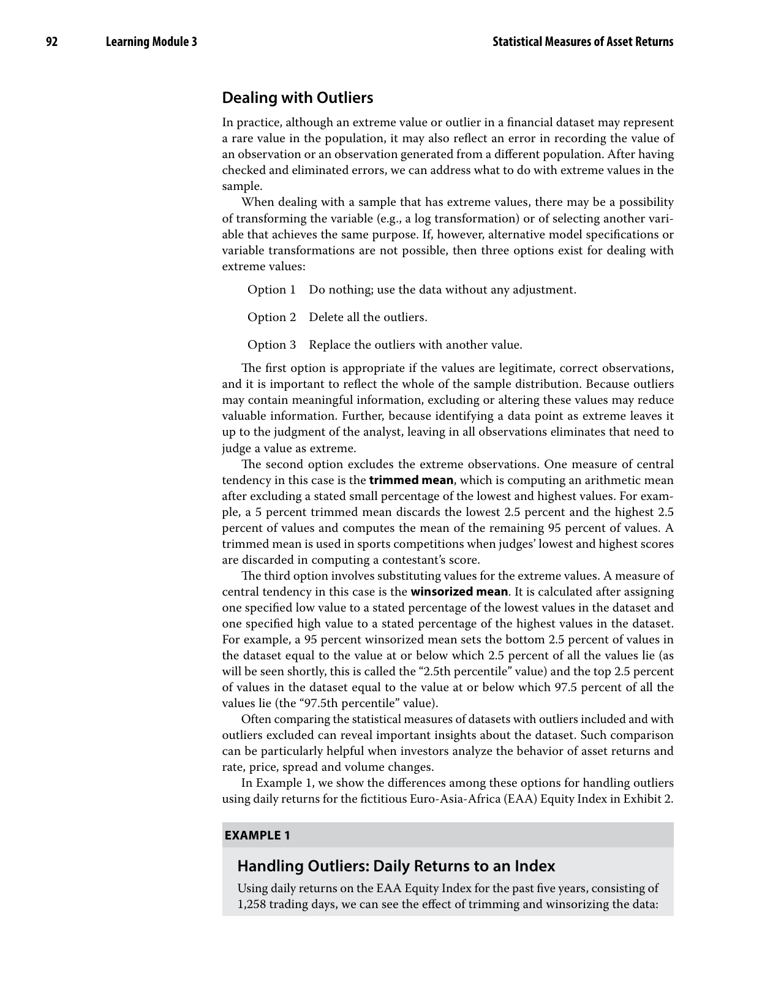

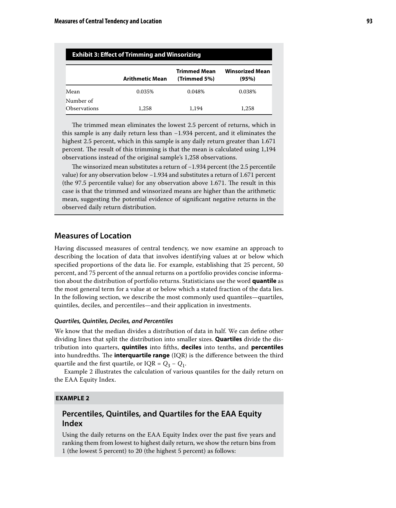

The module begins with the arithmetic mean,
because it is still the most common single-number summary of a dataset.

It is simply the sum of observations divided by the number of observations.

Pausa.

That makes the mean easy to compute and easy to work with mathematically.

But the curriculum immediately points to its weakness:

the mean is sensitive to outliers.

Large extreme values can pull it upward.

Small extreme values can pull it downward.

Pausa.

That is why the median matters.

If the sample size is odd,
the median is the middle ranked observation.

If the sample size is even,
the median is the average of the two middle ranked observations.

And because it depends on position rather than magnitude,
it is much less sensitive to outliers.

Pausa.

Then comes the mode:

the most frequently occurring value in the dataset.

A dataset can be:

- unimodal
- bimodal
- trimodal
- or have no mode at all

The mode is especially natural when data are grouped into intervals,
because the highest bar in a histogram reveals the modal interval.

Pausa lunga.

The EAA Equity Index example gives a frequency distribution of daily returns across one thousand two hundred fifty-eight trading days.

The return bins run from negative five percent to positive five percent.

The heaviest concentration of observations sits around the zero to one percent region,
which is exactly what the histogram visually suggests.

Pausa.

Then the curriculum faces the practical problem of outliers directly.

Once errors are checked,
three broad options remain:

- do nothing
- delete the outliers
- replace the outliers

Deleting outliers leads to a trimmed mean.

Replacing extreme values with threshold values leads to a winsorized mean.

Pausa.

The EAA daily-return example gives a nice comparison:

- arithmetic mean is zero point zero three five percent
- trimmed five-percent mean is zero point zero four eight percent
- ninety-five-percent winsorized mean is zero point zero three eight percent

The trimmed mean removes the lowest two point five percent and highest two point five percent of observations.

In this sample,
that means deleting daily returns below negative one point nine three four percent
and above positive one point six seven one percent.

The calculation then uses one thousand one hundred ninety-four observations instead of one thousand two hundred fifty-eight.

Pausa lunga.

The winsorized mean keeps the full sample size,
but replaces observations below negative one point nine three four with that threshold value,
and observations above positive one point six seven one with that upper threshold value.

That leaves the sample length unchanged,
but softens the effect of extremes.

Pausa.

The nice interpretive point here is that both the trimmed and winsorized means are higher than the raw arithmetic mean.

That hints at the presence of meaningful negative extreme returns in the original sample.

So again,
the number itself is not the whole story.

The comparison between summaries tells you something about the data-generating process.

## Quantiles, Box Plots, And The First Question Set

[Schermo: Percentiles / quartiles / box and whisker plots]

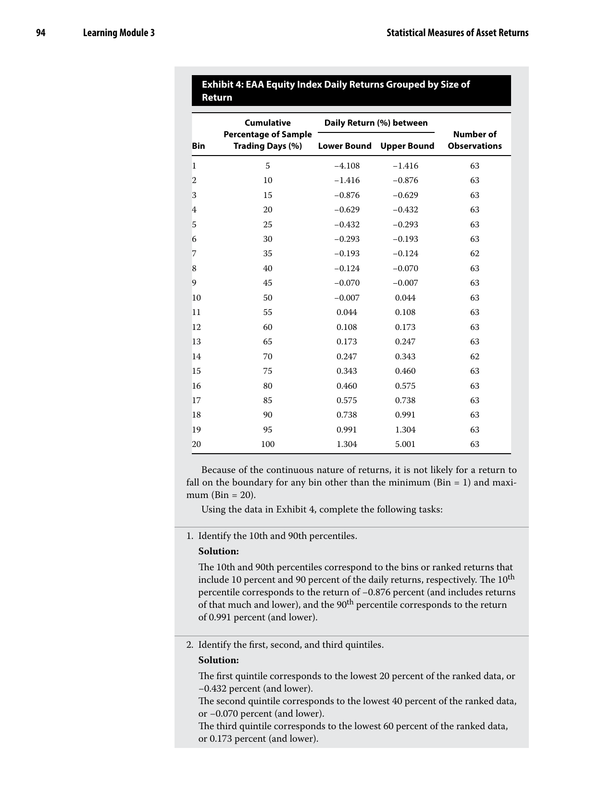

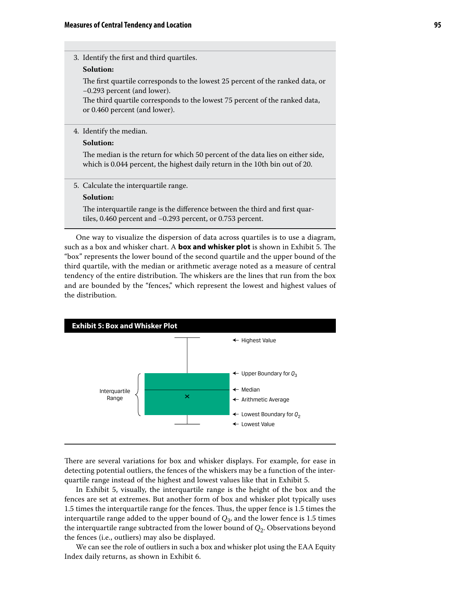

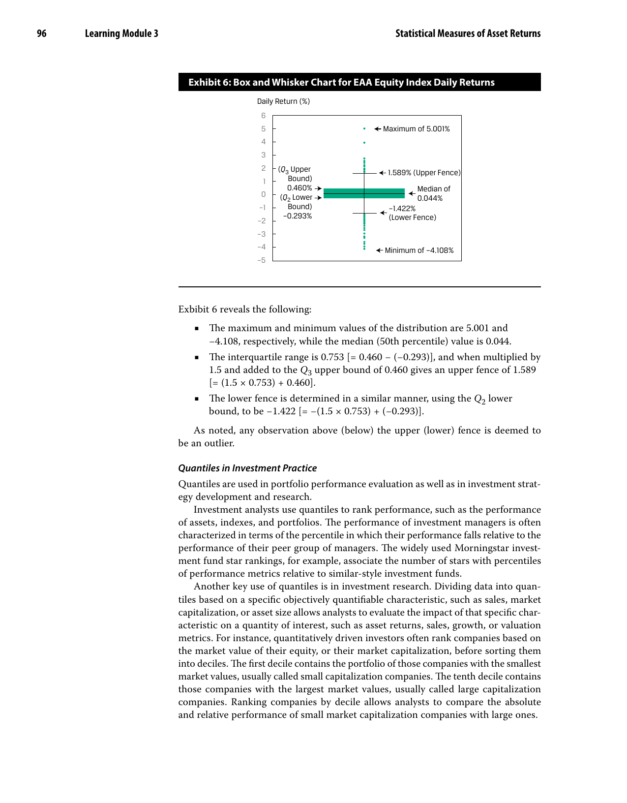

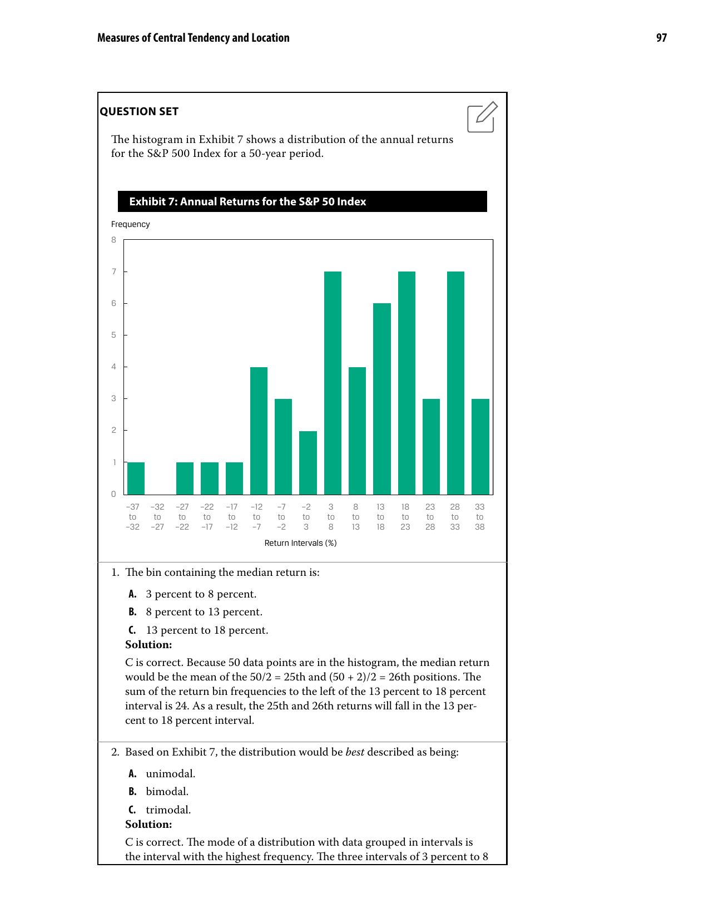

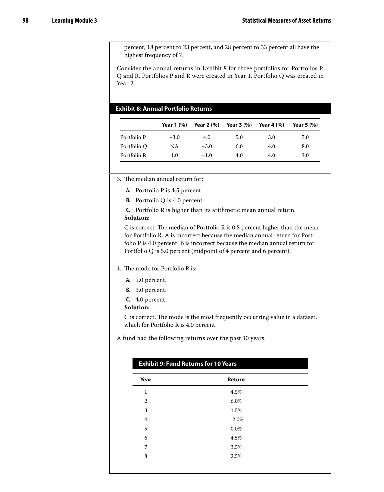

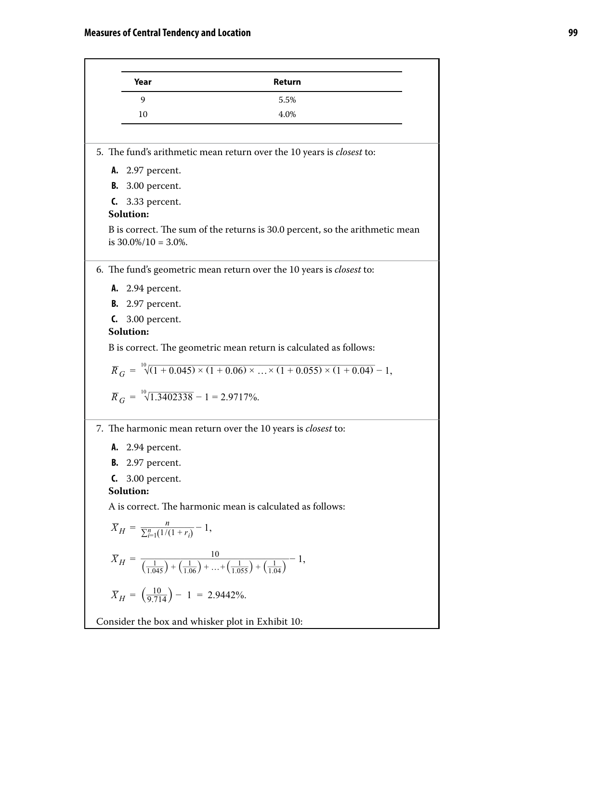

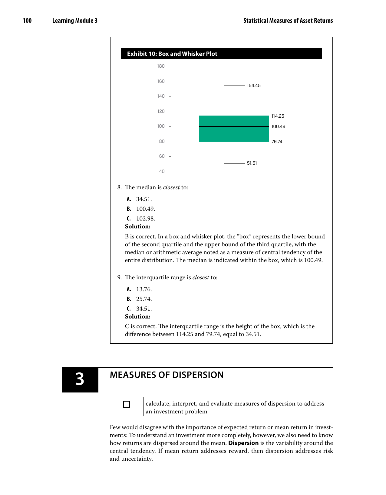

Once central tendency is in place,
the module extends the idea of location through quantiles.

Quartiles divide the data into quarters.

Quintiles divide them into fifths.

Deciles divide them into tenths.

Percentiles divide them into hundredths.

Pausa.

The EAA Equity Index example ranks five years of daily returns from lowest to highest
and groups them into twenty bins of five percent each.

That allows the curriculum to answer several location questions directly.

Pausa.

The tenth percentile is negative zero point eight seven six percent.

The ninetieth percentile is zero point nine nine one percent.

The first,
second,
and third quintiles are:

- negative zero point four three two
- negative zero point zero seven zero
- and positive zero point one seven three percent

The first quartile is negative zero point two nine three percent.

The third quartile is positive zero point four six zero percent.

The median is zero point zero four four percent.

And the interquartile range is zero point seven five three percent.

Pausa lunga.

This is where the box-and-whisker plot becomes helpful.

It compresses all of that location information into one picture.

The box runs from the first quartile to the third quartile.

The line inside the box marks the median.

And the whiskers stretch outward toward the fences.

Pausa.

For the EAA returns:

- the maximum is five point zero zero one percent
- the minimum is negative four point one zero eight percent
- the median is zero point zero four four percent
- the upper fence is one point five eight nine percent
- the lower fence is negative one point four two two percent

Any observation beyond those fences is treated as an outlier in that display.

Pausa.

The curriculum also explains why quantiles matter in investment practice.

Managers are often ranked by percentile within peer groups.

Funds can be assigned stars by relative performance buckets.

And quantitative researchers can sort companies into deciles,
such as small-cap through large-cap groups,
to compare behavior across size segments.

Pausa lunga.

Then the module pressure-tests the whole section with a question set.

From the S&P 500 histogram example,
the bin containing the median return is thirteen percent to eighteen percent.

And the distribution is best described as trimodal,
because three return intervals share the highest frequency.

Pausa.

From the three-portfolio example:

- Portfolio P has median four point zero percent, not four point five
- Portfolio Q has median five point zero percent, not four point zero
- Portfolio R has a median higher than its arithmetic mean

And for Portfolio R,
the mode is four point zero percent.

Pausa.

The ten-year fund return example brings us back to values we already know from early in the series.

The arithmetic mean is three point zero zero percent.

The geometric mean is about two point nine seven one seven percent.

And the harmonic mean is about two point nine four four two percent.

That last number is worth pausing on,
because it is not the plain formula from episode one.

The curriculum applies the harmonic mean to one plus each return,
and then subtracts one.

Ten,
divided by the sum of one over one plus r,
minus one.

That detour is necessary,
because the general harmonic mean formula requires every observation to be strictly positive,
and this ten-year series contains a zero year and a negative year.

Pausa.

That last comparison is quiet but helpful.

When returns vary,
the harmonic mean sits below the geometric mean,
which sits below the arithmetic mean.

Pausa lunga.

Finally,
the box-and-whisker question set shows a median of one hundred point four nine
and an interquartile range of thirty-four point five one.

And at the very bottom of the page,
the next section title appears:

- Measures of Dispersion

That is the perfect stopping point for this first statistical episode.

We have learned how to locate data.

Next we will learn how widely they spread.

## Closing

[Schermo: Practice tested / statistics opened / dispersion next]

Tonight we used the Learning Module Two practice set the way it is meant to be used:

as a stress test of the formulas.

Bond price,
mortgage payment,
constant growth,
two-stage growth,
holding-period return,
yield to maturity,
forward rates,
foreign exchange parity,
and option replication all had to survive contact with actual numbers.

Pausa.

Then we opened Learning Module Three and built the first layer of statistical description.

We identified where return data are centered,
how outliers can distort a mean,
how trimmed and winsorized means respond,
and how quantiles and box plots tell us where observations sit inside a distribution.

Pausa lunga.

The page now leaves us right at the threshold of dispersion.

That is a very strong handoff.

We know where the data live.

The next question is how far they spread from the center.

And that is where variance,
standard deviation,
downside deviation,
and coefficient of variation begin to matter.

Rest well.
Study well.
And I will see you in the next reading session.
