# CFA READING SESSION 07

Versione teleprompter
Linea guida: "Calm, accurate, sleep-friendly"

Nota di lavoro:
- source base: CFA Level I 2024 Volume 1
- coverage: Learning Module 4 from the module opening through the end of the practice problem solutions
- approximate PDF coverage for this episode: pages 143 to 162
- adapted for spoken delivery and pacing, without inventing facts beyond the source
- figures in flusso: original PDF page captures

## Opening

[Schermo: CFA Level I / Volume 1 / Session 07]

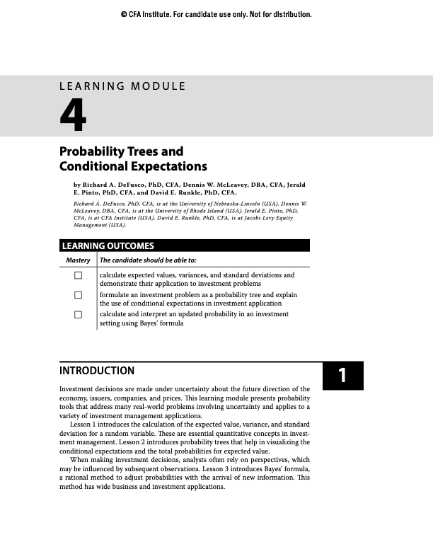

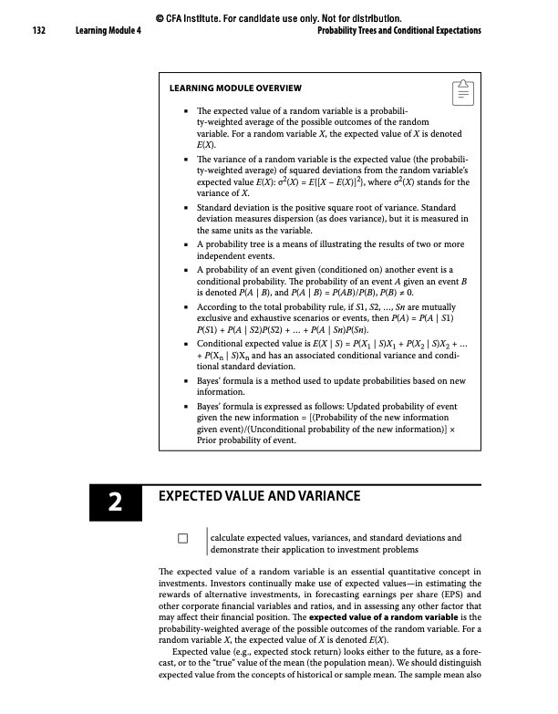

Welcome back to CFA Reading Session.

Tonight we open Learning Module Four:

Probability Trees and Conditional Expectations.

This module is compact,
but it is one of the quiet structural modules in Quant.

Because once probability enters,
forecasting stops being just a number
and becomes a map of possibilities.

Pausa.

The curriculum gives us three connected tools.

First,
expected value,
variance,
and standard deviation for a random variable.

Second,
probability trees and conditional expected values,
which let us organize scenarios without losing consistency.

Third,
Bayes' formula,
which tells us how to update a prior belief when new information arrives.

Pausa lunga.

So this episode has a simple shape.

We begin with a forecast.

Then we ask how uncertain that forecast is.

Then we let a scenario tree split the world into branches.

And finally,
we let new information flow backward through the tree
to revise what we thought before.

That is the rhythm of the whole lesson.

And it is also why this module feels more alive than a page of formulas.

Every number here belongs to a branch,
or to a belief,
or to a revision of a belief.

Probability is not being used as decoration.

It is being used as architecture.

That is why this lesson connects so naturally to later portfolio work.

Before we can combine assets,
or measure portfolio shortfall,
or simulate price paths,
we need to be comfortable assigning outcomes,
weighting them,
and revising them when the world changes.

## Expected Value And Variance

[Schermo: Forecast / dispersion / one random variable]

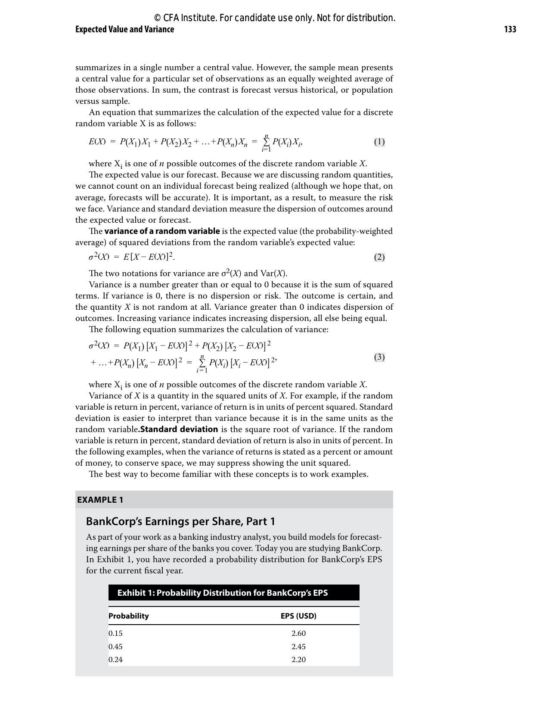

The module starts with the expected value of a discrete random variable.

Expected value is a probability-weighted average of possible outcomes.

It is not the same thing as a historical sample mean,
even though they can look similar on the page.

The sample mean summarizes observed data.

Expected value is a forecast,
or a population concept,
pointing toward what the random variable tends to produce when uncertainty is taken seriously.

Pausa.

The book then pairs expected value with variance.

Variance is the expected value of squared deviations from the expected value.

And standard deviation is the positive square root of variance.

Variance gives us spread in squared units.

Standard deviation returns us to the original unit of the variable,
which is why it is usually easier to interpret.

The curriculum is careful about this distinction.

If a variable is measured in percent,
variance is in percent squared,
which is mathematically useful but not naturally intuitive.

Standard deviation restores the original unit,
so it feels closer to the underlying economic quantity.

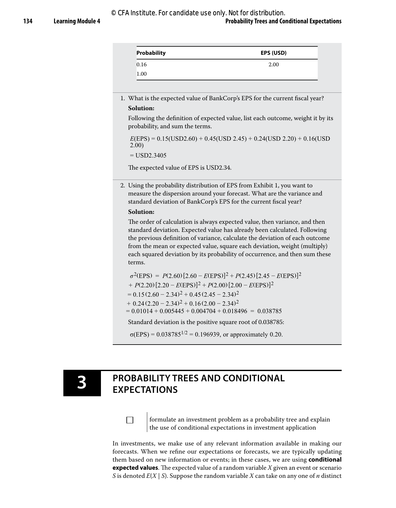

Example One uses BankCorp earnings per share.

The probability distribution is:

- 0.15 for EPS of 2.60 dollars
- 0.45 for EPS of 2.45 dollars
- 0.24 for EPS of 2.20 dollars
- 0.16 for EPS of 2.00 dollars

The probabilities sum to one,
as they must.

Now weight each outcome by its probability:

0.15 times 2.60,
plus 0.45 times 2.45,
plus 0.24 times 2.20,
plus 0.16 times 2.00.

That gives expected EPS of 2.3405 dollars,
or about 2.34.

Pausa.

Then we measure dispersion around that forecast.

It is worth hearing that expected value in a slightly slower way.

No single outcome in the distribution equals 2.3405.

Expected value is not required to be one of the listed outcomes.

It is a center of gravity,
not necessarily a realized state.

Each outcome is compared with 2.34,
the deviation is squared,
that squared deviation is weighted by its probability,
and then the weighted pieces are added.

The four contributions reported by the curriculum are:

- 0.01014
- 0.005445
- 0.004704
- 0.018496

Together they produce a variance of 0.038785.

The standard deviation is the square root of that value,
which is 0.196939,
or approximately 0.20.

So if you wanted to summarize BankCorp's EPS distribution in two quiet numbers,
the pair would be:

- expected EPS around 2.34 dollars
- standard deviation around 0.20 dollars

That pair tells us both direction and uncertainty.

And one more principle is tucked inside the formula section:

if variance were zero,
there would be no uncertainty at all.

The outcome would be certain,
and the variable would not really be random in any meaningful sense.

So the module's very first message is already complete:

forecast the center,
then forecast the uncertainty around the center.

And never confuse those two jobs.

## Conditional Expectations And Total Probability

[Schermo: Scenario branches / conditional expected value]

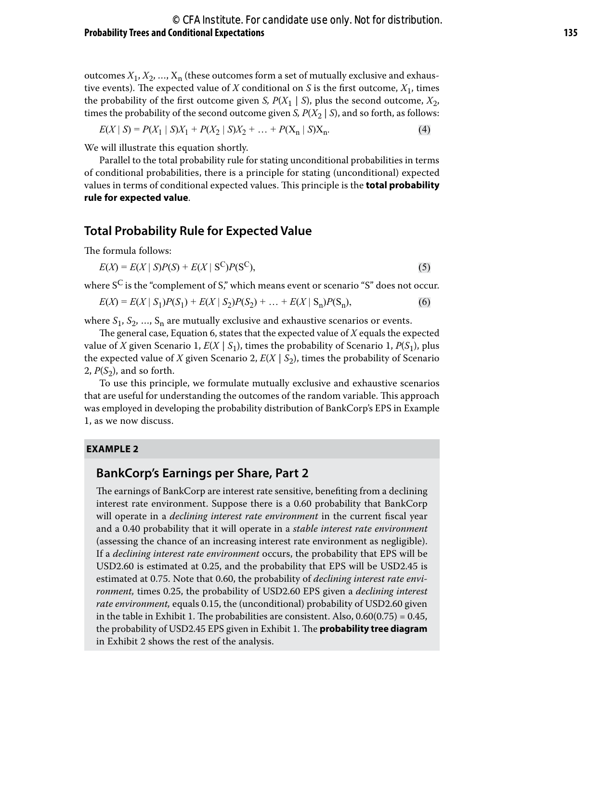

The next step is to condition the forecast on a scenario.

Instead of asking,
"What is expected EPS, period?"

we ask,
"What is expected EPS if a particular state of the world occurs?"

That is conditional expected value:
E of X given S.

The module also states the total probability rule for expected value.

If scenarios are mutually exclusive and exhaustive,
unconditional expected value must equal the weighted average of the conditional expected values.

That consistency matters.

If the unconditional and conditional views do not reconcile,
then our forecasting framework is broken.

The examples that follow keep checking this consistency again and again.

That repetition is useful.

It trains the instinct that branch-level thinking
and whole-distribution thinking
must connect cleanly.

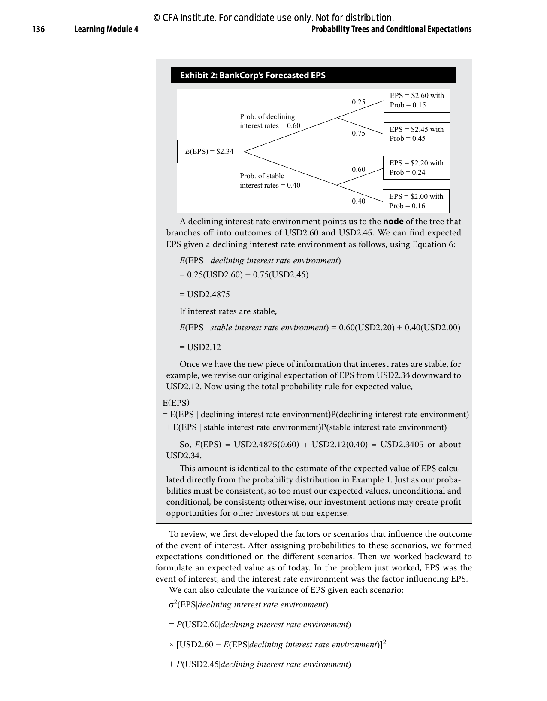

Example Two returns to BankCorp,
but now earnings depend on the interest-rate environment.

There is:

- a 0.60 probability of declining interest rates
- a 0.40 probability of stable interest rates

If rates decline,
EPS is 2.60 with probability 0.25
and 2.45 with probability 0.75.

If rates are stable,
EPS is 2.20 with probability 0.60
and 2.00 with probability 0.40.

Notice how the unconditional probabilities from Example One are still sitting underneath this tree.

The branch products reproduce them:

- 0.60 times 0.25 gives 0.15
- 0.60 times 0.75 gives 0.45
- 0.40 times 0.60 gives 0.24
- 0.40 times 0.40 gives 0.16

So the tree is not a different model.

It is a more informative decomposition of the same model.

Pausa.

Now compute the conditional means.

Given declining rates:

0.25 times 2.60
plus 0.75 times 2.45
equals 2.4875 dollars.

Given stable rates:

0.60 times 2.20
plus 0.40 times 2.00
equals 2.12 dollars.

That alone is already useful.

If we learn that rates are stable,
our EPS expectation drops from about 2.34 to 2.12.

If we learn that rates are declining,
our expectation rises to 2.4875.

This is one of the cleanest reasons to use conditional expectation in investing.

It lets us tie a forecast to a state of the world
instead of pretending the same mean fits every scenario equally well.

And because the branch probabilities and conditional probabilities are explicit,
the analyst can later challenge each assumption separately.

Was the rate scenario probability wrong?

Or were the EPS probabilities within the scenario wrong?

The tree keeps those questions distinct.

Pausa lunga.

Then the book walks backward to today's unconditional expectation:

2.4875 times 0.60
plus 2.12 times 0.40
equals 2.3405.

Exactly the same expected EPS we obtained before.

That is not a coincidence.

It is the whole point of the total probability rule for expected value.

The module then quietly reminds us that risk can also be conditional.

If the world narrows to one branch,
the relevant uncertainty narrows with it.

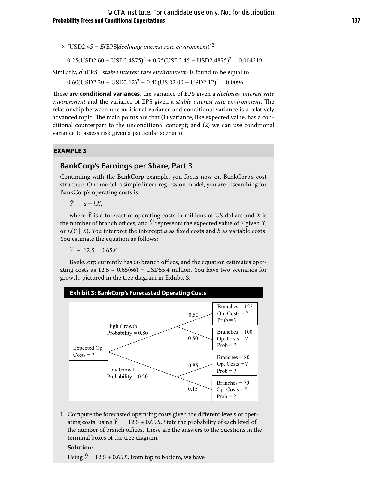

The curriculum also computes conditional variances.

Given declining rates,
the conditional variance of EPS is 0.004219.

Given stable rates,
the conditional variance is 0.0096.

So in this setup,
stable rates do not just lower expected EPS.

They also produce greater conditional dispersion.

In other words,
the scenario with the lower mean is also the scenario with the larger conditional risk.

That pairing is common enough in finance to be worth noticing.

That is a quiet but important investment lesson:

new information can change both the level of the forecast
and the uncertainty around the forecast.

## Probability Trees And Operating Costs

[Schermo: Tree structure / branch probabilities / scenario consistency]

Example Three shifts from earnings per share
to operating costs.

The cost model is a linear regression:

estimated operating costs equal 12.5
plus 0.65 times the number of branch offices.

BankCorp currently has 66 branches,
which implies estimated operating costs of 55.4 million dollars.

That current estimate gives us a baseline.

The future tree is then asking:

what happens to costs if the branch network expands under different growth paths?

But the point of the example is not the current estimate.

The point is to forecast future costs through a scenario tree.

Two growth scenarios are proposed:

- high growth with probability 0.80
- low growth with probability 0.20

Under high growth,
branch count is 125 with probability 0.50
or 100 with probability 0.50.

Under low growth,
branch count is 80 with probability 0.85
or 70 with probability 0.15.

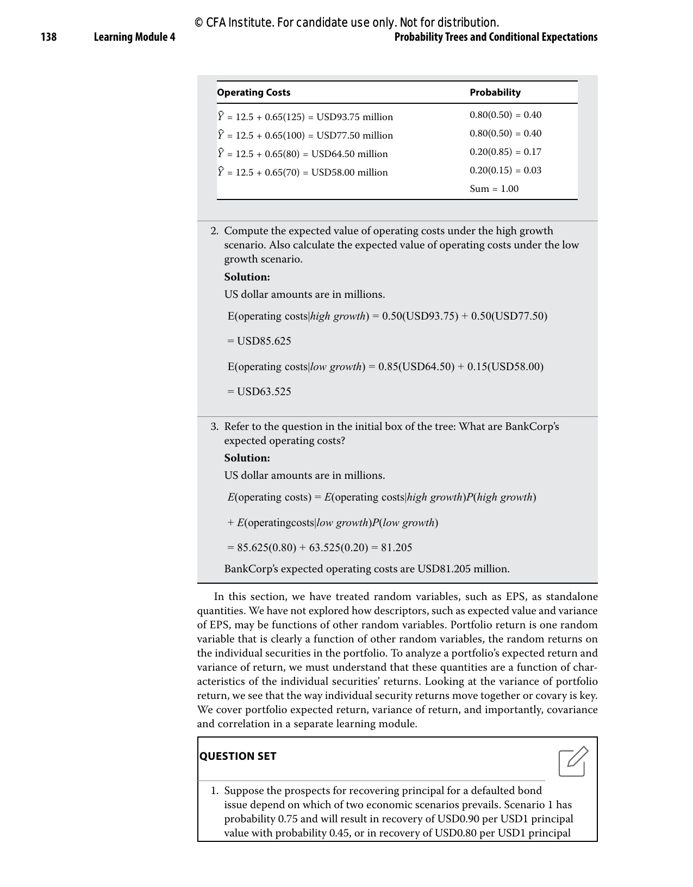

The operating-cost outcomes follow directly from the regression equation.

For 125 branches:

12.5 plus 0.65 times 125 equals 93.75 million.

For 100 branches:

12.5 plus 0.65 times 100 equals 77.50 million.

For 80 branches:

12.5 plus 0.65 times 80 equals 64.50 million.

For 70 branches:

12.5 plus 0.65 times 70 equals 58.00 million.

Because the model is linear,
the move from branches to costs is mechanical.

What makes the problem probabilistic is not the cost formula.

It is the uncertainty about which branch-count scenario will actually occur.

Pausa.

The terminal probabilities are found by multiplying down the branches:

- 0.80 times 0.50 equals 0.40
- 0.80 times 0.50 equals 0.40
- 0.20 times 0.85 equals 0.17
- 0.20 times 0.15 equals 0.03

And those four probabilities sum to one.

That is another check of internal consistency.

And the unconditional expected cost of 81.205 million is meaningfully above the current 55.4 million estimate.

That makes intuitive sense.

The tree is dominated by high-growth probability,
and high growth pushes branch count much higher.

Pausa.

Now compute expected operating costs conditional on growth state.

Given high growth:

0.50 times 93.75
plus 0.50 times 77.50
equals 85.625 million.

Given low growth:

0.85 times 64.50
plus 0.15 times 58.00
equals 63.525 million.

Then return to today's unconditional expectation:

85.625 times 0.80
plus 63.525 times 0.20
equals 81.205 million dollars.

This example is worth lingering on.

The tree does not change the algebra.

It changes visibility.

It lets us see which assumptions belong to which branch,
and where each probability enters the forecast.

That is why trees are so helpful in study sessions.

They slow down what would otherwise be hidden inside one compressed expected-value line.

And once a tree is drawn well,
you can usually solve the problem in two directions:

top to bottom,
to get terminal probabilities,

or bottom to top,
to recover unconditional expectations from conditional ones.

## Recovery Tree Question Set

[Schermo: Recoveries / scenario weighting / expected recovery]

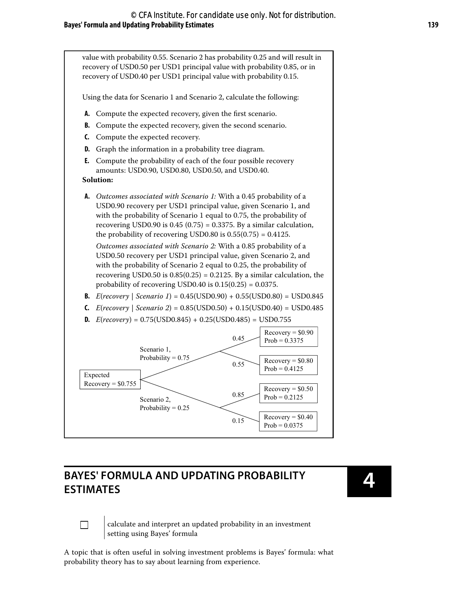

Before Bayes arrives,
the module gives one more scenario-tree exercise on recoveries from a defaulted bond.

Scenario One has probability 0.75.

Within Scenario One,
recovery is:

- 0.90 per dollar of principal with probability 0.45
- 0.80 per dollar with probability 0.55

Scenario Two has probability 0.25.

Within Scenario Two,
recovery is:

- 0.50 with probability 0.85
- 0.40 with probability 0.15

Pausa.

The terminal probabilities are:

- 0.3375 for recovery of 0.90
- 0.4125 for recovery of 0.80
- 0.2125 for recovery of 0.50
- 0.0375 for recovery of 0.40

And those four terminal probabilities also sum to one,
which is always a quick sanity check worth doing before you move on.

Now compute the conditional expected recoveries.

Given Scenario One:

0.45 times 0.90
plus 0.55 times 0.80
equals 0.845.

Given Scenario Two:

0.85 times 0.50
plus 0.15 times 0.40
equals 0.485.

Weight those by 0.75 and 0.25,
and the unconditional expected recovery becomes 0.755.

If you prefer,
you can also reach the same answer directly from the terminal nodes:

0.3375 times 0.90
plus 0.4125 times 0.80
plus 0.2125 times 0.50
plus 0.0375 times 0.40.

Either route gives the same expected recovery,
which is exactly what should happen in a well-formed tree.

That is another tree,
another forecast,
and the same governing principle:

conditional pieces first,
then a weighted step back to the whole.

## Bayes Formula Basics

[Schermo: Prior / likelihood / posterior]

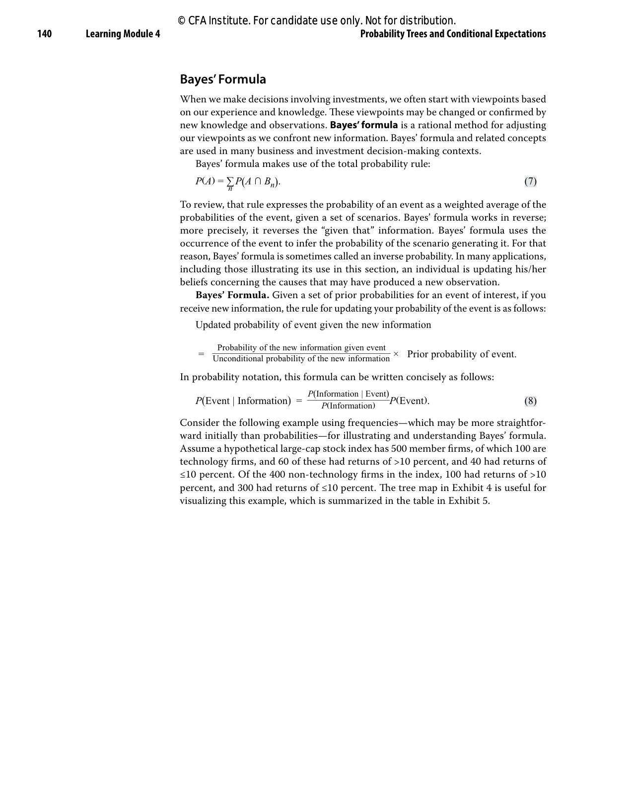

Now the module turns from forecasting
to updating.

Bayes' formula is what probability theory says
about learning from new information.

We start with a prior belief.

Then new information arrives.

Then we ask:

what should the revised probability be,
after taking that information seriously?

The book states the rule in words first:

updated probability of an event,
given new information,
equals

the probability of that information given the event,
divided by the unconditional probability of the information,
times the prior probability of the event.

Pausa.

That middle ratio is the lever.

Some people find Bayes easier when they rename the pieces.

Prior:
what I believed before.

Likelihood:
how compatible the new information is with each event.

Posterior:
what I believe after the update.

That vocabulary is not required for the arithmetic,
but it helps the intuition.

Another way to hear Bayes is this:

we are not asking only,
"How likely is this event?"

We are asking,
"Now that I have seen this information,
which event explains it best?"

If the new information is more likely under the event than it is overall,
the posterior probability rises.

If the new information is less likely under the event than it is overall,
the posterior probability falls.

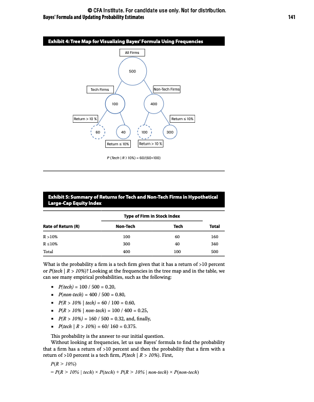

The first illustration uses frequencies,
which is a very good pedagogical move.

There are 500 firms in a hypothetical large-cap index.

Of these,
100 are technology firms
and 400 are non-technology firms.

Among the technology firms:

- 60 had returns above 10 percent
- 40 had returns at or below 10 percent

Among the non-tech firms:

- 100 had returns above 10 percent
- 300 had returns at or below 10 percent

So the question is:

what is the probability that a firm is a tech firm,
given that its return was above 10 percent?

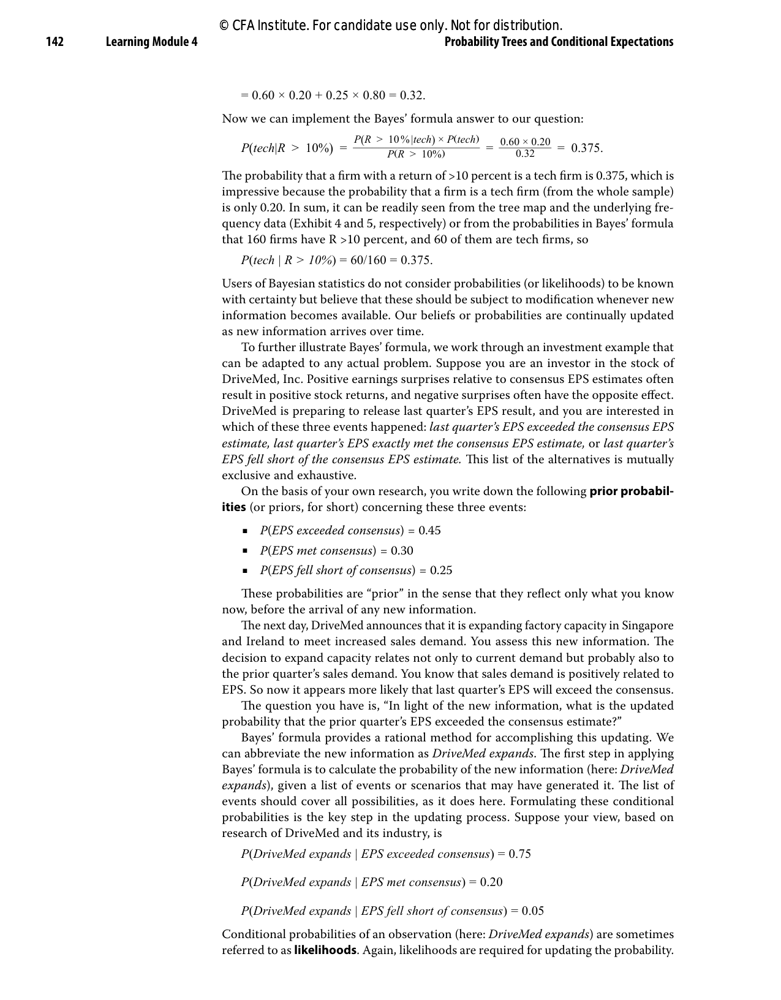

The answer can be seen immediately from counts.

There are 160 firms with returns above 10 percent,
and 60 of them are tech firms.

So:

60 divided by 160
equals 0.375.

Pausa.

Bayes gives the same answer in probability notation.

The ingredients are:

- P(tech) = 0.20
- P(non-tech) = 0.80
- P(return above 10 percent given tech) = 0.60
- P(return above 10 percent given non-tech) = 0.25

The unconditional probability of a return above 10 percent is:

0.60 times 0.20
plus 0.25 times 0.80
equals 0.32.

That 0.32 matters.

It is the denominator that keeps the update anchored to the overall frequency of the information.

Without it,
we would be comparing only local branch likelihoods and ignoring how common the information is in the full sample.

Then Bayes says:

P(tech given return above 10 percent)
equals
0.60 times 0.20 divided by 0.32,
which is 0.375.

So the posterior probability is much larger than the prior 0.20.

Why?

Because this information,
a return above 10 percent,
is much more likely under tech than it is in the population as a whole.

So the update moves in the direction of the branch that better explains the observation.

That is the reason Bayes often feels so natural once the notation settles down.

It is simply explanation weighted by prior plausibility.

## DriveMed Posterior Updates

[Schermo: New information / revised EPS beliefs]

At that point the module introduces its main investment example:

DriveMed.

Before any announcement,
the prior probabilities are:

- EPS exceeded consensus: 0.45
- EPS met consensus: 0.30
- EPS fell short of consensus: 0.25

Then new information arrives:

DriveMed announces expansion of factory capacity in Singapore and Ireland.

The analyst interprets that as evidence of stronger sales demand,
which in turn makes an earnings beat more plausible.

The relevant likelihoods are:

- P(expands given exceeded consensus) = 0.75
- P(expands given met consensus) = 0.20
- P(expands given fell short) = 0.05

These numbers are where the analyst's judgment really lives.

Bayes itself is not subjective.

But the likelihood inputs often come from research,
experience,
industry knowledge,
or a structured forecasting model.

So Bayes does not eliminate analyst judgment.

It disciplines it.

It forces the judgment to show up in explicit probabilities that can be examined,
criticized,
and updated again later.

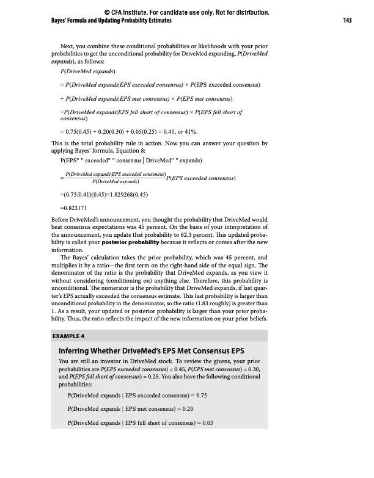

First calculate the unconditional probability of expansion.

Using the total probability rule:

0.75 times 0.45
plus 0.20 times 0.30
plus 0.05 times 0.25
equals 0.41.

So the probability of observing the expansion announcement,
before conditioning on any one earnings outcome,
is 41 percent.

Now apply Bayes to the event that EPS exceeded consensus:

0.75 divided by 0.41,
times 0.45,
equals 0.823171.

Rounded,
that is 82.3 percent.

So the analyst moves from a prior of 45 percent
to a posterior above 82 percent.

You can also see the mechanics through the ratio:

0.75 divided by 0.41 is about 1.8293.

Because that factor is well above one,
the prior of 0.45 gets pushed sharply upward.

Pausa lunga.

This is the heart of Bayes.

The prior does not disappear.

The information does not act alone.

The posterior is a combination of both.

The prior sets the starting point.

The likelihood ratio determines how strongly the new information pushes that starting point.

If the announcement had been equally likely under all three EPS outcomes,
there would have been no informational edge,
and the posterior probabilities would have stayed much closer to the priors.

That is another useful exam instinct:

information only has updating power to the extent that it discriminates among possible causes.

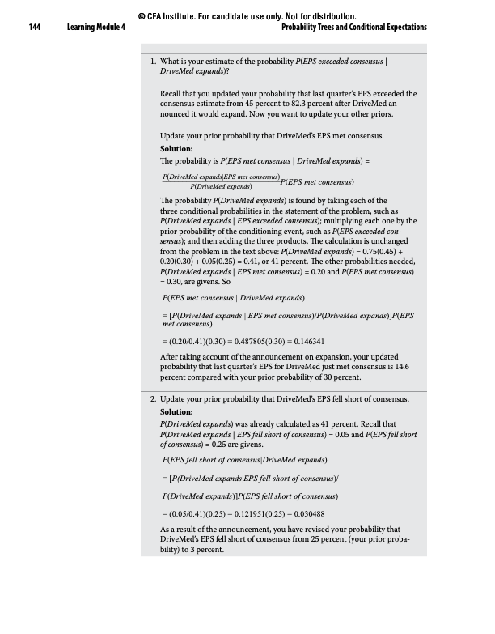

The module then updates the other two priors.

For the event that EPS merely met consensus:

0.20 divided by 0.41,
times 0.30,
equals 0.146341.

So that probability falls from 30 percent
to about 14.6 percent.

For the event that EPS fell short of consensus:

0.05 divided by 0.41,
times 0.25,
equals 0.030488.

So that probability collapses
from 25 percent
to about 3.0 percent.

That is a dramatic update,
but it is still internally disciplined.

The probability does not go to zero.

It just becomes much smaller because the expansion announcement is least compatible with an earnings shortfall in the analyst's model.

The announcement does not prove anything.

But under the analyst's interpretation,
it heavily reweights the earnings scenarios toward an upside surprise.

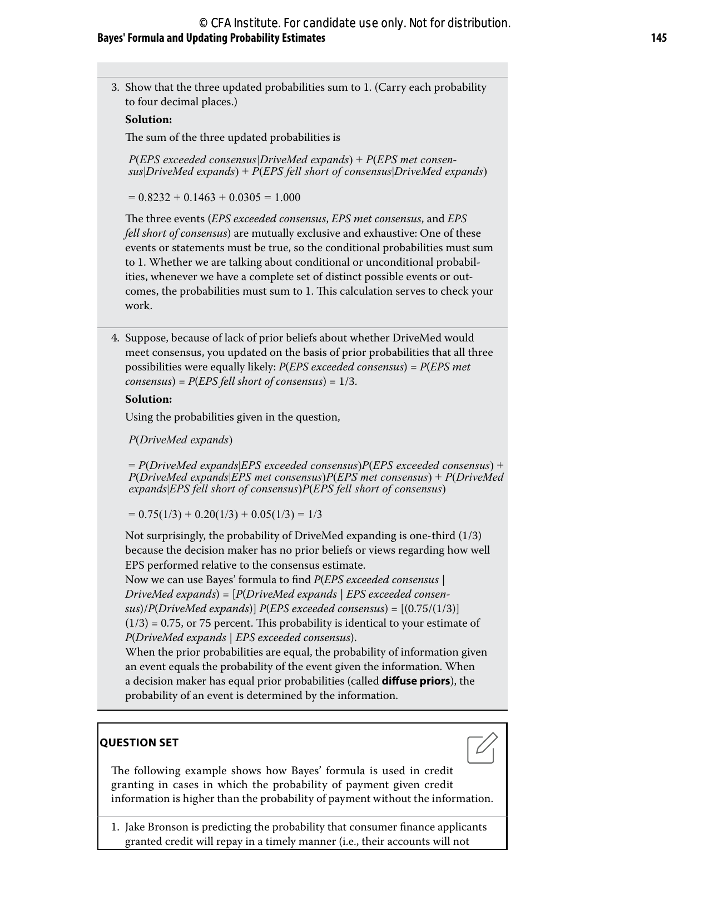

The curriculum then performs two useful checks.

First,
the three posteriors must sum to one.

And they do:

0.8232
plus 0.1463
plus 0.0305
equals 1.000.

Second,
it asks what happens if the prior probabilities were diffuse,
meaning all three were originally one-third.

In that case,
the unconditional probability of DriveMed expanding also becomes one-third:

0.75 times one-third
plus 0.20 times one-third
plus 0.05 times one-third
equals one-third.

Then the posterior probability of an earnings beat becomes:

0.75 divided by one-third,
times one-third,
which is simply 0.75.

So when priors are equal,
the posterior for the event lines up with the likelihood of the information given the event.

That is a very elegant special case.

Diffuse priors are often useful as a teaching benchmark,
because they reveal what the information alone is doing before strong prior beliefs are layered on top.

And in real investing,
that comparison can be helpful too.

You can ask:

how much of my conclusion is coming from prior conviction,
and how much is coming from the new evidence?

## Bayes Question Set

[Schermo: Credit scoring / bankruptcy / management interpretation]

The Bayes question set is practical and exam-shaped.

The first question uses credit reports.

Let event A be timely repayment,
and information B be a good credit report.

We are given:

- P(A) = 0.90
- P(B) = 0.80
- P(B given A) = 0.85

Bayes gives:

0.85 divided by 0.80,
times 0.90,
which equals 0.956.

So applicants with good credit reports
have a 95.6 percent probability of timely repayment under this setup.

Pausa.

The second question is richer.

Forty percent of companies are non-survivors within 12 months.

Fifty-five percent pass the test.

And the probability of passing given survival is 0.85.

The first sub-question asks for pass probability given non-survival.

Using the total probability rule,
that value comes out to 0.10.

That result is encouraging for the test.

Only ten percent of the eventual non-survivors are still passing,
which means failure on the test contains real warning power.

At the same time,
the survival posterior after a pass rises to about 92.7 percent,
which means the signal is useful in both directions:

passing reassures,
failing alarms.

Then the module asks for survival given a pass.

That posterior is:

0.85 divided by 0.55,
times 0.60,
which equals 0.927273.

So a pass raises the survival probability from 60 percent
to about 92.7 percent.

Next it asks for non-survival given a fail.

First infer fail given non-survival.

That comes out to 0.90.

Then use Bayes again:

0.90 divided by 0.45,
times 0.40,
equals 0.80.

So once the company fails the test,
the posterior non-survivor probability is no longer a mild concern.

It becomes the dominant case.

So failure on the test doubles the non-survivor probability,
from 40 percent to 80 percent.

The curriculum concludes that the test appears useful,
and that is a fair interpretation.

It moves probabilities in the right direction,
and by a meaningful amount.

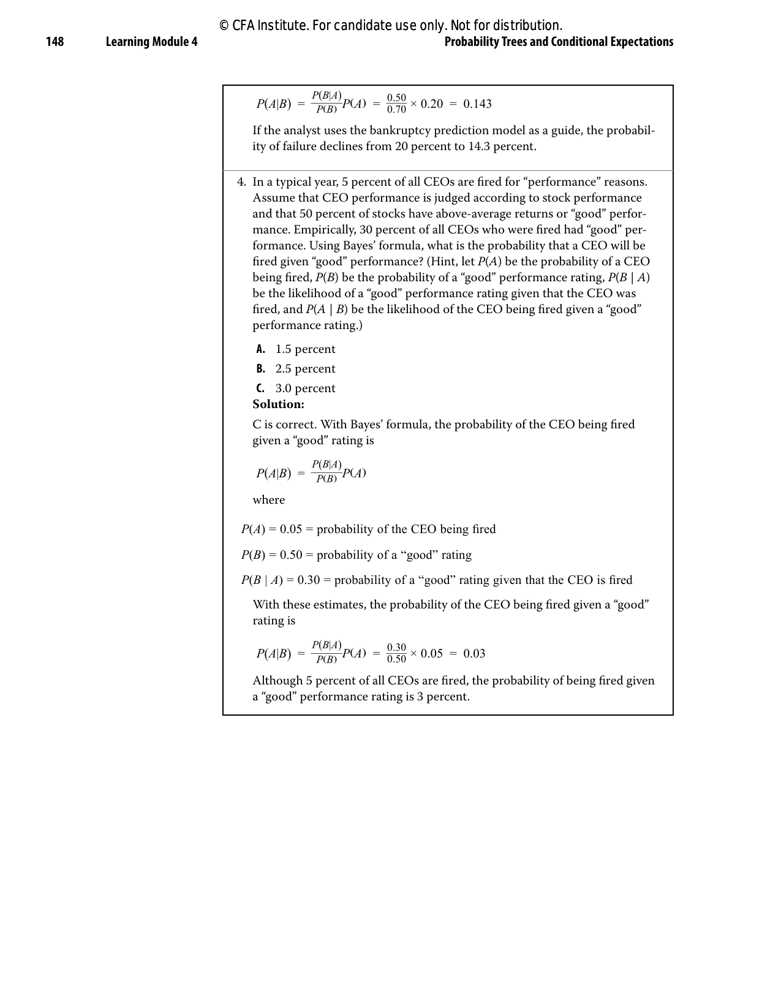

The remaining questions are shorter.

For high-risk bonds:

- prior probability of failure: 0.20
- probability of a good rating: 0.70
- probability of a good rating given failure: 0.50

Bayes gives:

0.50 divided by 0.70,
times 0.20,
which is 0.143,
or 14.3 percent.

So the model lowers the failure probability from 20 percent to 14.3 percent
when the bond receives a good rating.

Pausa.

Then comes the CEO example.

Five percent of CEOs are fired for performance reasons.

Half of stocks have above-average,
or good,
performance.

And 30 percent of fired CEOs had good performance.

So:

0.30 divided by 0.50,
times 0.05
equals 0.03.

That means the probability a CEO is fired given good performance is 3 percent.

Again,
the posterior is below the unconditional 5 percent,
but not zero.

This is a nice case where the information is favorable,
but the event of interest still happens sometimes for reasons outside the chosen signal.

That is very realistic.

Good performance lowers the likelihood of firing.

It does not eliminate it.

That final example is a nice reminder that posterior probabilities are conditional,
not moral judgments.

Even favorable information can coexist with a non-zero chance of an adverse outcome.

## Practice Problems And Solutions

[Schermo: Module 4 practice set / final numerical checks]

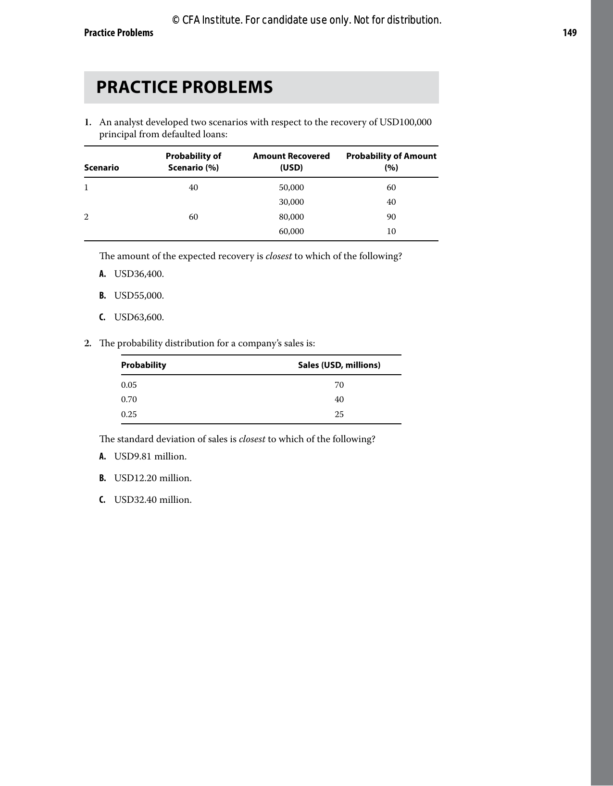

The module practice problems are only two,
but they are well chosen.

The first asks for expected recovery on defaulted loans.

Scenario One has 40 percent probability,
with recoveries of 50,000 dollars at 60 percent
and 30,000 dollars at 40 percent.

Scenario Two has 60 percent probability,
with recoveries of 80,000 dollars at 90 percent
and 60,000 dollars at 10 percent.

The cleanest way is to compute expected recovery in each scenario first.

Scenario One:

0.60 times 50,000
plus 0.40 times 30,000
equals 42,000.

Scenario Two:

0.90 times 80,000
plus 0.10 times 60,000
equals 78,000.

Then weight by scenario probabilities:

0.40 times 42,000
plus 0.60 times 78,000
equals 63,600.

If you flatten the tree instead,
you would get the same answer from the four terminal outcomes.

The curriculum points that out in the solution,
which is a useful exam habit:

if two valid methods disagree,
one of them contains an arithmetic mistake.

So the correct answer is 63,600 dollars.

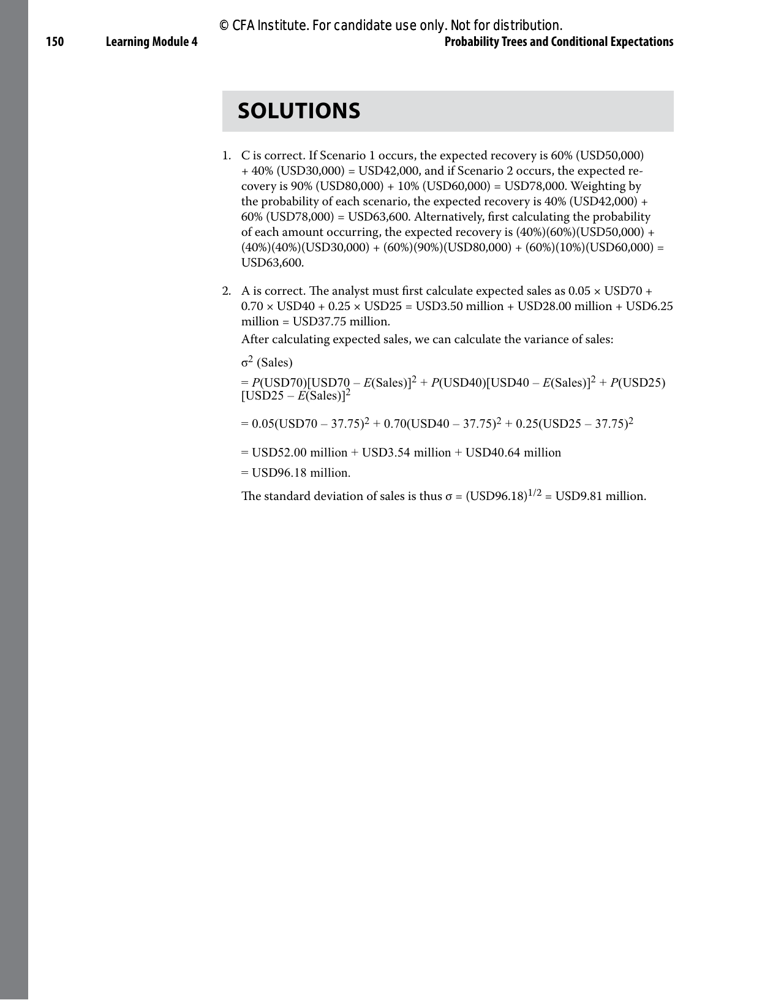

The second problem asks for the standard deviation of sales.

The sales distribution is:

- 0.05 for sales of 70 million
- 0.70 for sales of 40 million
- 0.25 for sales of 25 million

Expected sales are:

0.05 times 70
plus 0.70 times 40
plus 0.25 times 25
equals 37.75 million dollars.

Then variance is computed as the weighted sum of squared deviations from 37.75.

The three contributions shown in the solution are:

- 52.00
- 3.54
- 40.64

Those numbers come from the squared deviations around the mean of 37.75.

The largest contribution comes from the 70 million outcome,
because it sits farthest above the mean and still carries a non-zero probability.

More explicitly,
the deviations from the mean are:

- 70 minus 37.75, which is 32.25
- 40 minus 37.75, which is 2.25
- 25 minus 37.75, which is minus 12.75

Those are squared,
weighted by 0.05,
0.70,
and 0.25,
and then summed.

That is why the standard deviation result is a real dispersion measure,
not just a memorized answer.

These sum to 96.18.

Taking the square root gives a standard deviation of 9.81 million dollars.

That closes the module neatly.

We began with expected value and variance,
and the final practice problem asks us to do exactly that again,
with no extra decoration.

## Closing

[Schermo: Session recap / Learning Module 4 complete]

Tonight we did three kinds of thinking.

We forecast outcomes with probabilities.

We broke those outcomes into scenarios with trees.

And we revised prior beliefs using new information.

We covered:

- expected value
- variance
- standard deviation
- conditional expected value
- the total probability rule for expected value
- probability trees
- Bayes' formula
- posterior updating
- and the full module practice set

Pausa lunga.

If there is one quiet lesson underneath all of it,
it is this:

uncertainty does not disappear
when we assign a number.

It becomes structured.

And once it is structured,
we can update it intelligently.

Next time,
the volume turns the page to Portfolio Mathematics.

Rest well.
Study well.
And I will see you in the next reading session.
